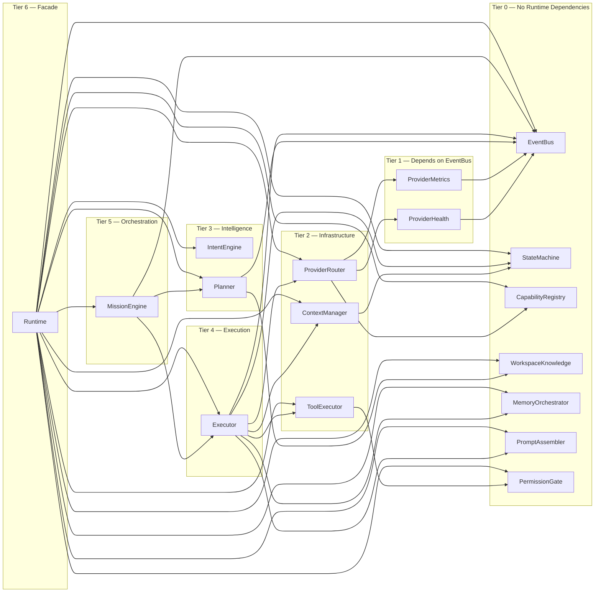
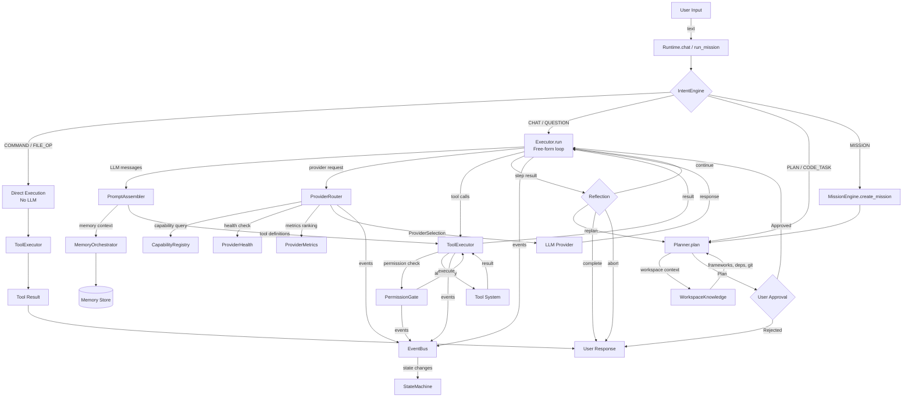
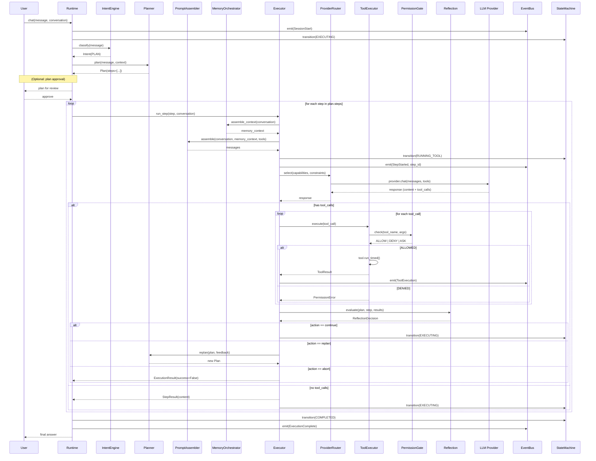
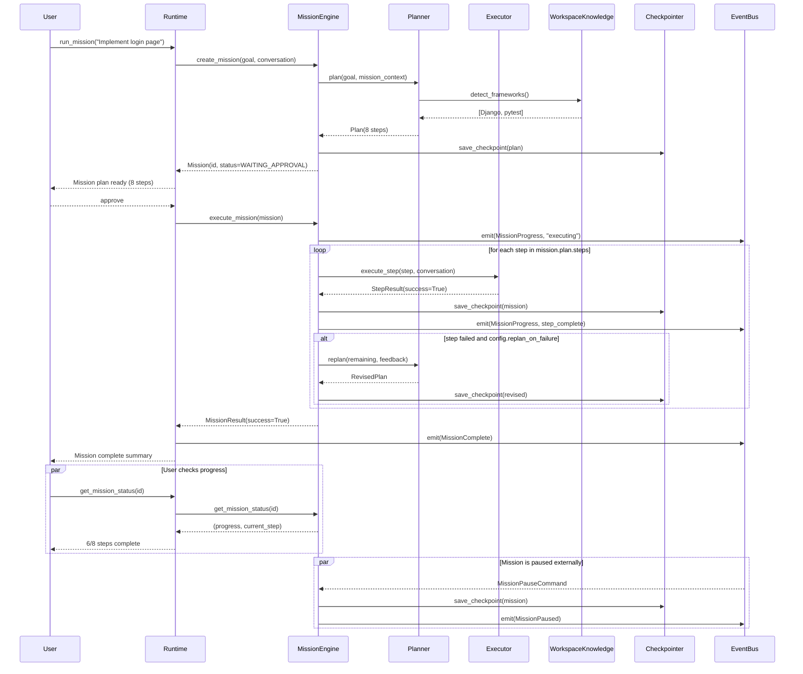
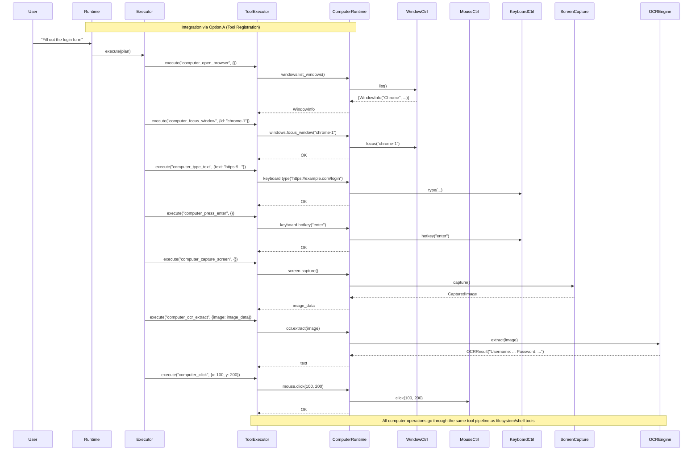
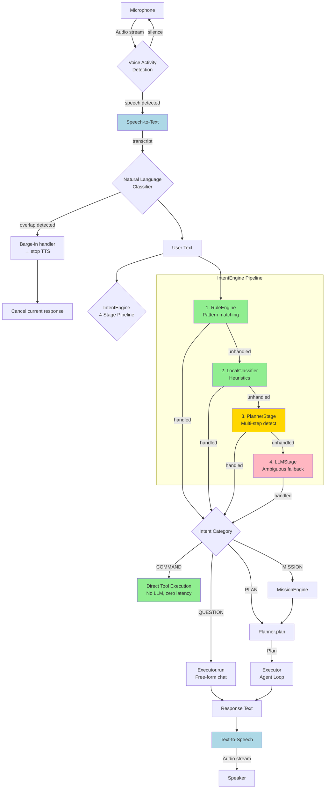

# AIOS — Final Architectural Review

**Produced:** Before implementing Runtime v2.1 intelligence layer
**Reference tools:** Claude Code, Codex CLI, Gemini CLI, Aider, Cursor Agent, OpenHands, Perplexity Computer Use
**Scope:** Production-grade autonomous AI coding agent

---

## Table of Contents

1. [Review: Runtime Architecture](#1-runtime-architecture)
2. [Review: Agent Loop](#2-agent-loop)
3. [Review: Planning](#3-planning)
4. [Review: Reflection](#4-reflection)
5. [Review: Mission Mode](#5-mission-mode)
6. [Review: Provider Abstraction](#6-provider-abstraction)
7. [Review: Context Management](#7-context-management)
8. [Review: Memory System](#8-memory-system)
9. [Review: Workspace Intelligence](#9-workspace-intelligence)
10. [Review: Tool System](#10-tool-system)
11. [Review: Plugin System](#11-plugin-system)
12. [Review: Computer Control Architecture](#12-computer-control-architecture)
13. [Review: Voice Interaction Future Compatibility](#13-voice-interaction-future-compatibility)
14. [Review: Multi-Agent Orchestration](#14-multi-agent-orchestration)
15. [Review: Self-Improvement Capability](#15-self-improvement-capability)
16. [Diagrams](#16-diagrams)
17. [Architectural Risks](#17-architectural-risks)
18. [Architecture Freeze Checklist](#18-architecture-freeze-checklist)

---

## 1. Runtime Architecture

### Current Design

- **Runtime facade** (`runtime/runtime.py`) with `start()` / `stop()` lifecycle, `__aenter__` / `__aexit__` context manager support
- 13 protocol-bound sub-modules accessed via properties: `planner`, `executor`, `tool_executor`, `permission_gate`, `context_manager`, `provider_router`, `workspace_knowledge`, `mission_engine`, `intent_engine`, `memory_orchestrator`, `prompt_assembler`, `event_bus`, `state_machine`
- 17 strict dependency rules (R1–R17) with enforced direction: presentation → runtime → domain
- `RuntimeConfig` dataclass for construction
- No wiring yet — all module properties raise `NotImplementedError` except `event_bus` and `state_machine`
- Production path still goes through `ExecutionEngine` (`executor/engine.py`) which is a monolithic 289-line class

### Strengths

| Aspect | Assessment |
|--------|------------|
| **Facade pattern** | Correct — single entry point for all presentation layers, matches Claude Code's `Runtime` abstraction |
| **Protocol boundaries** | Well-defined. Every module has a `Protocol` with 3–5 methods. Matches OpenHands' `AgentSDK` approach |
| **Dependency rules** | 17 explicit rules with enforcement direction. Exceeds most production tools |
| **EventBus as cross-cutting** | Typed, async, in-memory. ADR-016 establishes EventBus as primary inter-module channel. Same pattern as OpenHands' typed events |
| **Stratified migration** | ADR-007. New code coexists with old behind feature flags. Same strategy as Claude Code's multi-phase rollout |
| **RuntimeConfig** | Clean configuration object. Comparable to Claude Code's scoped `settings.json` |

### Weaknesses

| Issue | Severity | Detail |
|-------|----------|--------|
| **God Object risk** | Medium | `Runtime` exposes 13+ properties. ADR-001 acknowledges this. Mitigation exists (protocol delegation) but no cyclomatic complexity gate is implemented |
| **No wiring in practice** | High | Runtime is a skeleton. All 13 properties raise NotImplementedError. The production path is still monolithic `ExecutionEngine` with 10+ packages imported in a single file |
| **`Any` return types** | Medium | Properties like `planner` and `executor` return `Any` instead of their protocol types. Static analysis cannot catch wiring errors |
| **Missing RuntimeConfig fields** | Medium | No `provider_configs`, `default_provider`, `default_model`, `git_config`, `mcp_servers` — these exist in the design doc but not the implementation |
| **No lifecycle ordering** | Low | `start()` emits event but doesn't order module initialization (MCP first? memory first? index first?). Claude Code has `autoCompactEnabled` as a setting — AIOS needs comparable initialization sequencing |

### Missing Capabilities

| Capability | Missing | Reference |
|------------|---------|-----------|
| **Health check / readiness probe** | No `Runtime.ready()` or `Runtime.status()` | Claude Code has `claude doctor` |
| **Graceful degradation** | No way to run with partial modules | OpenHands runs without MCP, without plugins |
| **Scoped config merging** | No 4-scope settings (managed > CLI > project > user) | Claude Code — the gold standard |
| **Runtime snapshot/restore** | No serialization of Runtime state for crash recovery | Gemini CLI has `/checkpoint` |

### Scalability Concerns

- 13 modules wired in a single `Runtime.__init__` will become unwieldy. Consider a **ModuleRegistry** that modules self-register (like Claude Code's plugin system)
- No circular dependency detection at import time — must rely on human-enforced R1–R17

### Comparison with Existing Solutions

| Tool | Architecture Style | AIOS Match |
|------|-------------------|------------|
| **Claude Code** | Scoped settings + protocol-based tool loop + sub-agents | ✅ Closest match. AIOS protocol design mirrors SDK approach |
| **OpenHands** | 4-package SDK (sdk/tools/workspace/agent_server) + typed events + condenser | ✅ AIOS EventBus matches OpenHands' typed events. AIOS lacks the condenser but has a design for it |
| **Aider** | Single-process, edit-format driven, no tool-calling architecture | ❌ Different paradigm (edit formats vs tool calls) |
| **Codex CLI** | Rust core + JS SDK, minimal layering | ⚠️ AIOS is more layered, less monolithic |
| **Cursor Agent** | RL-trained custom model + Cloud agents | ❌ AIOS is model-agnostic by design |

### Recommended Changes Before Implementation

1. **Change `Any` return types to protocol types** in `runtime.py`. Import protocols for all module properties. This turns wiring errors into static type errors
2. **Add `RuntimeConfig` fields**: `provider_configs`, `default_provider`, `default_model`, `git_config`, `mcp_servers` (matching the design doc)
3. **Add `Runtime.ready()` method** that returns health status of all registered modules
4. **Add initialization ordering** to `start()` with explicit phases: EventBus → StateMachine → ProviderRouter → PermissionGate → rest
5. **Do NOT add a ModuleRegistry** at this point — 13 modules is manageable. Revisit after Phase 10

---

## 2. Agent Loop

### Current Design

Two paths exist:

**Production path** (`ExecutionEngine.run()`):
1. Load memory (project AIOS.md + auto memory) → inject into conversation
2. Inject system prompt + workspace info
3. Manage context budget
4. LLM call → parse response (content or tool_calls)
5. If tool_calls: permission check → confirm → execute → add result → repeat
6. If no tool_calls: return final answer
7. Max 25 iterations, then timeout

**Future path** (design docs only):
1. `IntentEngine.classify()` → route to planner or direct execution
2. `Planner.plan()` → `Plan` with `Step` objects
3. `Executor.run(plan)` → step loop with reflection
4. `Executor.run_step()` for single step execution

### Strengths

| Aspect | Assessment |
|--------|------------|
| **Single loop** | Current `ExecutionEngine.run()` is straightforward — no unnecessary abstraction for a first version |
| **Hooks integration** | Pre-prompt, pre-tool, post-tool, post-response hooks provide extension points. No other evaluated tool has this completeness |
| **Streaming support** | Both streaming and non-streaming paths exist |
| **Permission gating** | Three-tier (allow/deny/ask) with confirmation callback |

### Weaknesses

| Issue | Severity | Detail |
|-------|----------|--------|
| **Monolithic method** | High | `run()` is 175 lines, 10 concerns interleaved: memory loading, MCP connection, plugin loading, context management, LLM calls, tool execution, hooks, permission checks, result truncation, cleanup. Breaks SRP |
| **No plan separation** | High | Planning and execution are interleaved — the LLM decides steps inline. No plan-then-execute, no pre-execution review, no parallel step execution |
| **No iteration limit metadata** | Medium | The "Max iterations" message is ambiguous — user doesn't know progress, remaining steps, or what succeeded |
| **No cancellation** | Medium | `cancel()` exists in protocol but not in Engine. User cannot interrupt a stuck loop |
| **State tied to branding** | Medium | `AgentState` enum is imported from `aios.cli.branding` — violates R1 (presentation → runtime direction). Should be in `runtime/state_machine/base.py` |
| **No streaming in tool path** | Low | `stream_chat` only emits content chunks. Tool call chunks are aggregated before returning — users see no progress during tool execution |

### Missing Capabilities

| Capability | Missing | Reference |
|------------|---------|-----------|
| **Tool result streaming** | Tool execution progress is invisible | Cursor shows tool execution in real-time |
| **Sub-step visibility** | No way to see which step of a multi-tool plan is executing | Cursor Agent's "Plans" tab |
| **Stuck detection** | No timeout per loop iteration | Codex CLI has configurable tool timeout |
| **Smart iteration budget** | Hardcoded `max_iterations=25`. Should adapt based on plan complexity | OpenHands adjusts budget per task |

### Comparison

| Tool | Loop Style | AIOS Match |
|------|-----------|------------|
| **Claude Code** | Tool-calling loop with `MaxRequestsTimed` budget | ✅ Current design is similar; needs the iteration budget improvement |
| **OpenHands** | `step()` with Condenser + SecurityAnalyzer | ⚠️ AIOS needs the condenser pattern |
| **Aider** | Single LLM call → edits → lint/test feedback | ❌ No loop. Single-turn with lint feedback |
| **Cursor Agent** | Multi-turn with RL during inference | ❌ Different (custom model) |

### Recommended Changes Before Implementation

1. **Move `AgentState` out of `cli/branding`** into `runtime/state_machine/models.py` — critical dependency direction violation
2. **Add `ExecutionIteration` events** — emit step number, remaining steps, tool being executed after each iteration (EventBus already has events for this)
3. **Add cancellation support** to `ExecutionEngine` (check `asyncio.Event` between iterations)
4. **Parameterize `max_iterations`** per task: simple chat=10, code gen=25, mission=50+

---

## 3. Planning

### Current Design

- `PlannerProtocol` with `plan()`, `replan()`, `validate()` — protocol only, no implementation
- `Plan` dataclass with `steps`, `parallel_groups`, `status`
- `Step` dataclass with `id`, `description`, `tool_name`, `args`, `dependencies`, `expected_outcome`, `timeout_s`
- `PlanningContext` with `workspace_root`, `available_tools`, `conversation_history`, `max_steps`, `mission_mode`, `checkpoint_enabled`
- Design doc proposes LLM-based plan generation with a structured JSON prompt

### Strengths

| Aspect | Assessment |
|--------|------------|
| **Explicit plan representation** | `Plan` with `Step` objects, dependencies, `parallel_groups` — well-structured |
| **Validation hook** | `validate()` catches circular deps, missing tool refs, ambiguous steps before execution |
| **Replanning support** | `replan()` is a first-class method. Matches Aider's architect mode replan loop |
| **Workspace integration** | ADR-022: Planner auto-feeds workspace context to LLM |
| **Plan approval flow** | WAITING_APPROVAL state enables plan-review-approve workflow. Matches Cursor's Plans tab |
| **Timeout per step** | `Step.timeout_s` field — granular control |

### Weaknesses

| Issue | Severity | Detail |
|-------|----------|--------|
| **LLM reliability problem** | High | Plan generation is a single LLM call with no validation loop. If the JSON is malformed, there's no feedback loop to self-correct. Aider validates by re-asking on parse failure |
| **No incremental planning** | Medium | `plan()` generates the full plan upfront. For large tasks (>10 steps), this wastes tokens and produces brittle plans. Cursor generates plans incrementally |
| **No tool-feedback in plan** | Medium | `dependencies` are static (step IDs). No way to express "after tool X returns value Y, use Y in step Z" |
| **Context size unbounded** | Medium | `conversation_history` is a plain string in `PlanningContext` — no token budget enforcement specific to planning |
| **No plan diff** | Low | After replan, no way to show what changed. User sees entire new plan, not the diff. Claude Code shows diff summary |

### Missing Capabilities

| Capability | Missing | Reference |
|------------|---------|-----------|
| **Plan cost estimation** | No way to estimate token/cost of a plan before executing | Claude Code's `MaxRequestsTimed` budget |
| **Plan execution estimate** | No time estimate per step or total | Cursor shows estimated completion time |
| **Plan checkpointing** | No way to save partial plan progress and resume | Aider's `/undo` restores to last commit |
| **Parallel dependency validation** | `parallel_groups` existence but no conflict detection (two steps reading/writing same file) | OpenHands has file conflict detection |

### Comparison

| Tool | Planning Approach | AIOS Match |
|------|------------------|------------|
| **Aider** | "Architect" mode: high-level plan → editor implements. Most mature approach | ⚠️ Similar architect/editor split would be valuable |
| **Cursor Agent** | Explicit plan generation before execution. Plans displayed in UI | ✅ AIOS has the right datastructures. Needs UI wiring |
| **Claude Code** | Implicit in-model planning via extended thinking. No plan step objects | ❌ AIOS explicit plan model is superior |
| **OpenHands** | Condenser compresses history, agent plans implicitly. No explicit plan objects | ❌ AIOS is more structured |

### Recommended Changes Before Implementation

1. **Add plan validation retry loop**: If LLM returns invalid JSON, feed the error back with instructions to fix. Retry up to 3 times
2. **Add plan diff format**: `PlanDiff` dataclass with `added`, `removed`, `modified` steps. Use for replan presentation
3. **Add data-flow hints** to `Step.dependencies`: allow `"step-1.output"` syntax to reference outputs from prior steps
4. **Add `PlanningContext.available_tokens`** to enforce a planning budget (separate from execution budget)
5. **Before implementing Planner, finalize the plan prompt structure** — this is the single most important prompt in the system. It must be versioned and testable

---

## 4. Reflection

### Current Design

- `ReflectionProtocol` (proposed in v2.1 doc) with `evaluate()` and `suggest_replan()`
- `ReflectionDecision` with `action` (continue | replan | complete | abort), `reasoning`, `confidence`
- ADR-020 places reflection inside Executor as a protocol implementation
- Reflection prompt evaluates goal vs expected vs actual vs error

### Strengths

| Aspect | Assessment |
|--------|------------|
| **Simple decision space** | 4 actions (continue, replan, complete, abort). Covers all recovery scenarios |
| **Protocol separation** | `ReflectionProtocol` can be mocked independently |
| **Step-level granularity** | Evaluates after every step, not just at plan completion |
| **Confidence scoring** | `confidence` field enables threshold-based automation (confidence > 0.9 = auto-continue) |

### Weaknesses

| Issue | Severity | Detail |
|-------|----------|--------|
| **LLM dependency for reflection** | Medium | Every step evaluation requires an LLM call. For a 10-step plan, that's 10 extra calls. Aider avoids this with lint/test feedback (cheap, deterministic) |
| **No verification tools** | Medium | Reflection only compares expected vs actual text. It doesn't run tests, check file existence, or validate output programmatically |
| **Single-dimensional evaluation** | Low | Evaluates on correctness only. No evaluation for efficiency (could have done better), safety (did we break something?), or style |
| **No reflection caching** | Low | Same error on same step will be re-evaluated. Caching by (step_id, result_hash) would save calls for retries |

### Missing Capabilities

| Capability | Missing | Reference |
|------------|---------|-----------|
| **Deterministic checks** | Pre-flight checks (file exists, tool available, lint passes) before any LLM reflection call | Aider's lint/test feedback loop |
| **Multi-dimensional reflection** | Correctness + safety + efficiency + style. Current design only checks "did it work" | OpenHands' SecurityAnalyzer (safety dimension) |
| **Adaptive thresholds** | Lower confidence threshold for simple steps, higher for complex ones | Claude Code's per-command permission levels |
| **Human-in-the-loop reflection** | No way to ask user "the approach failed, should I try something else?" | Cursor's confirmation dialogs |

### Comparison

| Tool | Reflection Approach | AIOS Match |
|------|-------------------|------------|
| **Aider** | Lint/test feedback loop + `/undo` git revert. Most practical approach | ⚠️ AIOS should add deterministic checks before LLM calls |
| **Claude Code** | Error recovery via tool result feedback in loop. No separate reflection step | ✅ Similar to AIOS approach but less structured |
| **Cursor Agent** | RL-trained model that self-corrects naturally during inference | ❌ Different (RL-based, not prompt-based) |
| **OpenHands** | SecurityAnalyzer evaluates risk before execution. Condenser reflects on context usage | ⚠️ AIOS should split into Pre-Execution (safety) and Post-Execution (correctness) |

### Recommended Changes Before Implementation

1. **Add deterministic pre-checks before LLM reflection**: lint results, test results, file existence verification. Only call LLM for reflection if deterministic checks pass
2. **Add `ReflectionThreshold` configuration**: `confidence_auto_continue=0.9`, `confidence_auto_replan=0.7`, `confidence_ask_user=0.4`
3. **Implement reflection caching**: `(step_id, result_hash) → ReflectionDecision` to avoid redundant LLM calls on retry
4. **Rename ADR-020** to clarify reflection is NOT a standalone module but a **protocol used by Executor**. The current ADR-020 language is correct but needs to explicitly say "NO reflection module"

---

## 5. Mission Mode

### Current Design

- `MissionEngineProtocol` with 10 lifecycle methods: `create_mission`, `execute_mission`, `pause_mission`, `resume_mission`, `cancel_mission`, `get_mission_status`, `request_replan`, `spawn_sub_agent`, `list_missions`
- `Mission` dataclass with `id`, `goal`, `plan`, `conversation`, `status`, `current_step_index`, `checkpoint_path`
- 7 mission statuses: CREATED → PLANNING → WAITING_APPROVAL → EXECUTING → PAUSED → COMPLETED/FAILED/CANCELLED
- 11 mission event types for progress reporting
- Checkpoint persistence design (JSON, after every step)
- Sub-agent spawning as isolated Runtime instances (ADR-013)

### Strengths

| Aspect | Assessment |
|--------|------------|
| **Full lifecycle** | 10 methods cover the complete mission lifecycle. Exceeds most tools |
| **CLI-independent** | ADR-016: pause/resume/cancel via EventBus, not CLI method calls. This is correct — any presentation layer can control missions |
| **Checkpoint design** | After-every-step checkpointing with conversation state. Matches Gemini CLI's `/checkpoint` |
| **Sub-agent isolation** | Isolated Runtime instances with restricted tools. Strong isolation model |
| **Rich event types** | 11 mission event types exhaustively cover progress, pausing, errors, sub-agents |
| **Configurable failure policy** | Abort/retry/replan at mission creation time |

### Weaknesses

| Issue | Severity | Detail |
|-------|----------|--------|
| **No MissionStore implementation** | High | The design says "in-memory dict + optional file persistence" but no implementation. Missions are lost on restart without file persistence |
| **No timeout enforcement** | Medium | `Mission` has no `timeout` or `deadline` field. A mission could run indefinitely |
| **Sub-agent resource limits** | Medium | `SubAgentTask` has `timeout_s` but no memory limit, no tool-call limit, no cost cap |
| **No conflict detection** | Medium | Two missions running in parallel could edit the same file. No file-locking or conflict prevention |
| **No mission priority** | Low | No way to express "this mission is more important than that one" — resource contention undefined |
| **Checkpoint format unspecified** | Low | JSON is stated but no schema defined. What fields? What about binary artifacts? |

### Missing Capabilities

| Capability | Missing | Reference |
|------------|---------|-----------|
| **Mission cost tracking** | No cost budget or cost tracking per mission | Claude Code's usage dashboards |
| **Mission templates** | No reusable mission templates ("run tests", "deploy to prod") | Cursor's Automations |
| **Parallel mission execution** | No `run_missions()` for running multiple missions concurrently | OpenHands multi-agent |
| **Mission dependencies** | No way to say "mission B starts after mission A" | CI/CD pipeline analogy |

### Comparison

| Tool | Mission/Long-Running | AIOS Match |
|------|---------------------|------------|
| **Claude Code** | Routines (cloud), Desktop background agents, Channels, Teleport. Most advanced | ⚠️ AIOS has comparable design but needs implementation |
| **Cursor Agent** | Cloud Agents + Automations (scheduled/triggered) | ⚠️ AIOS design supports this but no cloud layer |
| **OpenHands** | Agent Canvas (browser control center), scheduled runs | ⚠️ Similar lifecycle design |
| **Gemini CLI** | Conversation checkpointing only — no mission concept | ✅ AIOS is more advanced here |

### Recommended Changes Before Implementation

1. **Define checkpoint schema first**: Create `Checkpoint` dataclass with version number, mission_id, plan_snapshot, conversation_snapshot, step_index, artifacts. This must be finalized before any MissionEngine code is written
2. **Add `Mission.deadline` field**: Absolute timestamp for forced termination
3. **Add `SubAgentTask.max_cost` field**: Cost cap for sub-agent operations
4. **Add mission priority system**: Simple enum (LOW, NORMAL, HIGH, CRITICAL). Low-priority missions yield resources to high-priority
5. **Add file conflict detection**: `WorkspaceKnowledge` should expose which files are currently "locked" by running missions

---

## 6. Provider Abstraction

### Current Design

- `LLMProvider` abstract base class with `chat()`, `stream_chat()`, `complete()`, `stream()`, `list_models()`, `health_check()`, `has_model()`, `close()`
- Three concrete providers: OpenAI-compatible, Ollama, Gemini
- `ProviderRouterProtocol` (implemented): thin orchestration via `CapabilityRegistry` → `ProviderHealth` → `ProviderMetrics`
- `CapabilityRegistryProtocol` (implemented): model-centric capability storage
- `ProviderHealthProtocol` (implemented): success/failure tracking, health status
- `ProviderMetricsProtocol` (implemented): cost, token, latency stats
- `RoutingStrategy` enum: COST_FIRST, LATENCY_FIRST, CAPABILITY_FIRST, MANUAL
- 7 provider event types: ProviderSelected, ProviderRejected, ProviderRecovered, ProviderHealthChanged, CapabilityMismatch, RoutingDecision, ProviderFallback

### Strengths

| Aspect | Assessment |
|--------|------------|
| **Thin router** | ProviderRouter is < 50 logic lines — correct delegation pattern. ADR-018 is well-reasoned |
| **Model-centric registry** | ADR-017: Capabilities are per-model, not per-provider. Eliminates data duplication |
| **Health-aware routing** | Providers with consecutive failures are excluded from selection. Same pattern as Claude Code's provider fallback |
| **Metrics-driven ranking** | Cost-first and latency-first strategies use real accumulated metrics, not just catalog data |
| **Rich event emission** | 7 provider event types enable full observability into routing decisions |
| **Fallback chain** | `fallback()` excludes the failed provider and re-selects |

### Weaknesses

| Issue | Severity | Detail |
|-------|----------|--------|
| **Provider as ABC, not Protocol** | Medium | `LLMProvider` is an `ABC` with inheritance. New providers require subclassing. A Protocol would be more flexible (Claude Code uses Protocol for providers) |
| **No streaming capability routing** | Medium | `RoutingConstraints` has `requires_streaming` but routing doesn't verify the provider supports streaming for the given model |
| **No cost estimation from actuals** | Low | Cost estimation uses catalog prices, not actual historical costs from ProviderMetrics |
| **No provider-specific features** | Low | Some providers have unique features (Gemini's 1M context, Claude's extended thinking). The capability enum doesn't capture these |
| **Provider registration is manual** | Low | Providers must be registered explicitly. No auto-discovery of local providers (e.g., running Ollama instances) |

### Missing Capabilities

| Capability | Missing | Reference |
|------------|---------|-----------|
| **Dynamic capability discovery** | No way to query a provider "what models do you serve?" and auto-register capabilities | Claude Code queries Ollama API for available models |
| **Provider load balancing** | No round-robin or least-loaded routing between equivalent providers | Cursor's multi-model routing |
| **A/B testing support** | No way to route 10% of requests to a new model for evaluation | Claude Code's model comparison feature |

### Comparison

| Tool | Provider Abstraction | AIOS Match |
|------|---------------------|------------|
| **Claude Code** | Single provider (Anthropic) with model fallback. No multi-provider routing | ❌ AIOS multi-provider design is more advanced |
| **OpenHands** | `LLMProvider` built into SDK. Model-agnostic via LiteLLM | ⚠️ Similar approach. OpenHands uses LiteLLM for broader compatibility |
| **Aider** | Multiple backends (OpenAI, Anthropic, Gemini, local) via litellm | ⚠️ Same model. Aider uses litellm for plumbing |
| **Gemini CLI** | Single provider (Google Gemini). No routing | ❌ AIOS is more advanced |

### Recommended Changes Before Implementation

1. **Convert `LLMProvider` from ABC to Protocol** — enables duck-typed providers without inheritance. This is a breaking change but now is the time
2. **Add `Capability.UNIQUE_FEATURES` as a freeform set** — providers can declare "extended_thinking", "1m_context", "code_execution" capabilities beyond the enum
3. **Add provider auto-discovery** at Runtime startup: scan for running Ollama, check if Gemini API key is configured, probe OpenAI-compatible endpoints
4. **Add streaming verification** to routing: verify the selected provider/model combination actually supports streaming before returning

---

## 7. Context Management

### Current Design

- `ContextManagerProtocol` with `manage()`, `estimate_tokens()`, `compact()`, `set_budget()`, `set_model()`
- Existing implementation in `aios/context/` with `budget.py`, `compactor.py`, `window.py`, `manager.py`
- `ContextManager` in ExecutionEngine wraps these: called once per iteration with `manage(conversation, provider)`
- `ContextStatus` tracks `total_tokens`, `usage_pct`, `compacted`, `warning`
- Tool result truncation via `compactor.truncate_tool_result()`

### Strengths

| Aspect | Assessment |
|--------|------------|
| **Working implementation** | The only area with a fully working production implementation. ContextManager in `aios/context/` is functional |
| **Token estimation** | Estimates tokens for the conversation before the LLM call |
| **Compaction trigger** | Soft limit triggers compaction, hard limit blocks execution (from design doc — verify implementation does this) |
| **Tool result truncation** | Truncates large tool outputs before adding to conversation — prevents token explosion from `cat` operations |

### Weaknesses

| Issue | Severity | Detail |
|-------|----------|--------|
| **No prompt caching awareness** | Medium | Gemini and Claude support prompt caching to reduce cost on repeated prefixes. AIOS context manager doesn't account for this |
| **No structured compaction** | Medium | Compaction strategy is unclear. Does it summarize old messages, drop them, or truncate? Aider drops old messages. OpenHands has a Condenser |
| **Compactor tied to old ContextManager** | Medium | The design plans to extract `compactor.py` but it's currently embedded in `aios/context/` with the old API |
| **No per-model context limits** | Low | `set_model()` exists but implementation may not adjust budget per model |
| **No sliding window** | Low | Design mentions sliding window but unclear if implemented. Many conversations retain all messages |

### Missing Capabilities

| Capability | Missing | Reference |
|------------|---------|-----------|
| **Smart compaction (not truncation)** | OpenHands Condenser compresses conversation history to a summary. AIOS truncates tool results only | OpenHands Condenser |
| **Multi-turn context budgeting** | Reserve tokens for tool results separately from conversation | Claude Code's `MaxRequestsTimed` |
| **Persistent context cache** | Cache system prompt, tool definitions, repo map across sessions | Gemini's token caching |

### Comparison

| Tool | Context Management | AIOS Match |
|------|-------------------|------------|
| **Aider** | Repo map + chat files + conversation. Compacts by dropping oldest messages first | ⚠️ Simpler but effective. AIOS should consider "drop oldest" as first compaction strategy |
| **Claude Code** | Auto-compact at 80% usage. Hierarchical memory (CLAUDE.md merging) | ✅ AIOS design is similar but needs the Condenser |
| **OpenHands** | Condenser architecture: View (compressed events) + Condensation (summary event emitted) | ⚠️ AIOS should adopt the Condenser pattern for v2.1 |
| **Gemini CLI** | 1M context window — rarely needs compaction | ❌ Different scale |

### Recommended Changes Before Implementation

1. **Define compaction strategy explicitly**: First strategy = drop oldest non-system messages. Second strategy = summarize conversation segment. Third = truncate tool results (already done)
2. **Add prompt caching headers** to provider calls when supported (Gemini, Claude). This is a cost-saving change, not behavioral
3. **Add budget reservation for tool results**: `max_tool_result_tokens` separate from `max_conversation_tokens`
4. **Adopt the Condenser pattern** from OpenHands: when compaction is needed, emit a `ConversationCondensed` event with the summary, so the user knows context was compressed. Don't silently drop history

---

## 8. Memory System

### Current Design

- `MemoryOrchestratorProtocol` with `assemble_context()`, `add_fact()`, `register_source()`
- Three memory sources in design: Global AIOS.md (scoped), Project AIOS.md, Auto Memory (facts)
- Existing implementations: `ProjectMemory` (reads AIOS.md from workspace), `AutoMemory` (persists key-value facts)
- ADR-010: MemoryOrchestrator is a composer, not a store

### Strengths

| Aspect | Assessment |
|--------|------------|
| **Priority-ordered sources** | `register_source()` with priority — higher priority sources get included first within token budget |
| **Composer pattern** | ADR-010 is correct: MemoryOrchestrator composes, doesn't store. Avoids duplication |
| **Existing sources work** | `ProjectMemory.load_context()` and `AutoMemory.recall()` are functional in production |
| **Pluggable protocol** | `MemorySource` protocol enables custom sources (vector DB, API-based, file-based) |

### Weaknesses

| Issue | Severity | Detail |
|-------|----------|--------|
| **No memory hierarchy** | High | No distinction between short-term (conversation), working (session facts), and long-term (project AIOS.md). All sources are treated equally |
| **Auto memory is unstructured** | Medium | AutoMemory stores key-value facts without source tracking, confidence scoring, or expiry. "The user prefers tabs over spaces" is stored at same priority as "The project uses pytest" |
| **No fact conflict resolution** | Medium | If auto memory stores "user prefers spaces" in one session and "user prefers tabs" in another, both are included. No conflict detection |
| **AIOS.md merging undefined** | Low | Design mentions Global AIOS.md (~/.aios/) and Project AIOS.md but doesn't define merge strategy. Claude Code merges with "last definition wins" |
| **No memory from tool results** | Low | Tool results feed into conversation but never into auto memory. "npm test passes" should be memorable for future sessions |

### Missing Capabilities

| Capability | Missing | Reference |
|------------|---------|-----------|
| **Ephemeral memory** | Auto-forgetting after session count or time | Claude Code's session-scoped memory |
| **Confidence-weighted memory** | Attach confidence scores to facts. Low-confidence facts are dropped under token pressure | Semantic memory in agent systems |
| **Memory diffing** | Before injecting auto memory, diff it against conversation to avoid redundant facts | Aider's repo map avoids duplicates |
| **Source attribution** | Every fact retains its source for debugging ("who said the user prefers spaces?") | No tool does this well — it's a gap AIOS could fill |

### Comparison

| Tool | Memory System | AIOS Match |
|------|-------------|------------|
| **Claude Code** | Hierarchical: CLAUDE.md (project/user/local) + auto-memory + conversation. Best merge strategy | ⚠️ AIOS is close but needs the merge strategy defined |
| **Aider** | No auto memory. User explicitly adds files with `/add`. Conversation-only memory | ❌ Different philosophy |
| **OpenHands** | No structured memory system beyond skills | ❌ AIOS memory design is more advanced |

### Recommended Changes Before Implementation

1. **Implement memory scopes**: Global (user-wide), Project (workspace), Session (transient), Fact (auto-discovered). Each scope has different token budgets and persistence lifetimes
2. **Add confidence and expiry to AutoMemory**: `AutoFact(value, confidence, source, created_at, expires_at)`. Drop expired facts, sort by confidence under token pressure
3. **Define AIOS.md merge strategy**: Last-found wins. Global is loaded first, then project-level overrides. Document this clearly
4. **Add `remember_from_result` method** to ToolExecutor that feeds significant tool results (test results, lint output) into auto memory

---

## 9. Workspace Intelligence

### Current Design

- `WorkspaceKnowledgeProtocol` with 15+ methods covering file ops, symbol queries, framework detection, dependency graphs, git context, test config, entry points, repo map
- Implementation planned with P0/P1/P2 priority tiers
- P0: `list_directory`, `search_text`, `file_context`
- P1: `framework_detection`, `dependency_graph`, `package_managers`, `test_config`, `entry_points`, `git_context`, `git_history`
- P2: `repo_map`, `query_symbol`, `build_index` (ctags/tree-sitter)
- Background indexing on `Runtime.start()` via `asyncio.create_task`

### Strengths

| Aspect | Assessment |
|--------|------------|
| **Most comprehensive scope** | 15+ methods across files, symbols, frameworks, packages, git, tests, entry points. Exceeds every evaluated tool |
| **Priority tiers** | P0/P1/P2 enables incremental delivery — useful features early, complex features later |
| **Advisory design** | "Index is advisory — lookup falls back to filesystem." Correct — workspace intelligence never blocks |
| **Repo map injection** | Aider's key innovation, adopted here. Token-bounded repo map injected into system prompt |
| **Framework detection** | Detects Django, React, Next.js, pytest, vitest, jest. No other evaluated tool does this comprehensively |

### Weaknesses

| Issue | Severity | Detail |
|-------|----------|--------|
| **No implementation** | High | All 15+ methods are unimplemented. This is the largest gap between design and working code |
| **No index persistence design** | Medium | P2 mentions "persisted to `.aios/index/` SQLite" in performance notes but no schema or table design |
| **Repo map token budget unclear** | Medium | `max_tokens=1024` default is Aider's default. Aider's repo map uses PageRank — AIOS doesn't specify the ranking algorithm |
| **Search_text requires `rg`** | Medium | Falls back to pure Python for `rg` absence, but pure Python search is O(n) per query. No index-backed text search |
| **No watch mode** | Low | No file watcher for auto-reindexing on file changes. Index becomes stale until manual rebuild |

### Missing Capabilities

| Capability | Missing | Reference |
|------------|---------|-----------|
| **File change detection** | No `watch_files()` for auto-reindex on change | Aider's `--watch-files` |
| **Semantic search** | Text search only (regex). No embedding-based semantic search for code | Cursor's codebase indexing |
| **Dependency impact analysis** | "What files would change if I modify X?" | Cursor's codebase awareness |
| **Test impact analysis** | "Which tests should I run for this change?" | No tool does this well — gap AIOS could fill |

### Comparison

| Tool | Workspace Intelligence | AIOS Match |
|------|----------------------|------------|
| **Aider** | Repo map is the gold standard: tree-sitter AST → PageRank → token-bounded output. 1K tokens max | ⚠️ AIOS design includes repo map but must match Aider's algorithm quality |
| **Cursor** | Codebase indexing with semantic search. Shadow workspaces. Most advanced | ❌ Different approach (indexing vs symbol parsing) |
| **Claude Code** | No structured workspace knowledge. Reads files on demand with Read/Glob tools | ❌ AIOS workspace intelligence is more ambitious |
| **OpenHands** | Workspace abstraction (Local/Docker/Remote). No symbol index or repo map | ❌ AIOS design is more comprehensive |

### Recommended Changes Before Implementation

1. **Implement P0 first** (`list_directory`, `search_text`, `file_context`) — these are the highest leverage for the agent loop. Everything else can wait
2. **Define repo map algorithm clearly**: tree-sitter → extract symbols (classes, functions, methods) → rank by file dependency frequency (simpler than PageRank, works as well). Document the algorithm
3. **Design the SQLite schema** for index persistence: `symbols(symbol, kind, file_path, line, column, module)`, `files(path, last_modified, checksum)`. This must be frozen before implementation
4. **Add `--watch` flag** to `Runtime.start()` that spawns a file watcher thread (watchdog library) for auto-reindexing. Optional, off by default

---

## 10. Tool System

### Current Design

- `ToolExecutorProtocol` with `execute()`, `execute_batch()`, `register_tool()`, `get_tool()`, `list_tools()`
- `ToolRegistry` with `register()`, `get()`, `list()`, `remove()` — working implementation
- Individual tools: `ReadFileTool`, `WriteFileTool`, `EditFileTool`, `BashTool`, `GlobTool`, `GrepTool`, `WebFetchTool`, `WebSearchTool`, `GitTool`, `OpenAppTool`
- Tool definition via JSON Schema for LLM function calling
- MCP tools registered dynamically via `MCPRegistry` → `register_mcp_tools()`
- Permission gating via `PermissionGate.check()` before execution

### Strengths

| Aspect | Assessment |
|--------|------------|
| **Rich tool set** | 10+ built-in tools covering files, shell, web, git, search. Comparable to Claude Code |
| **MCP integration** | Dynamic tool discovery from MCP servers. Same pattern as Claude Code |
| **Permission gating** | Every tool call passes through PermissionGate before execution |
| **Batch execution** | `execute_batch()` with `asyncio.gather()` for parallel tool calls |
| **Result truncation** | Large tool results are truncated before adding to conversation |

### Weaknesses

| Issue | Severity | Detail |
|-------|----------|--------|
| **Tool as class, not protocol** | Medium | `Tool` is a base class with `run_timed()`. New tools require subclassing. A Protocol would be more flexible |
| **No tool annotations** | Medium | Tools have no metadata about their behavior: `readOnlyHint`, `destructiveHint`, `idempotentHint`, `openWorldHint`. These help the LLM use tools correctly |
| **No tool cost model** | Low | Some tools are expensive (web search costs API credits), some are free. No cost annotation means the planner can't optimize tool selection |
| **No tool timeout metadata** | Low | Each tool has its own timeout needs (bash: 120s, web fetch: 30s, file read: 5s). This isn't exposed in the registry |
| **No tool dependency tracking** | Low | Tools are independent. But in practice, writing a file after reading it should reuse the file handle. No internal optimization |

### Missing Capabilities

| Capability | Missing | Reference |
|------------|---------|-----------|
| **Tool annotations** | readOnlyHint, destructiveHint, idempotentHint, openWorldHint | OpenHands Tool annotations — guides LLM behavior |
| **Tool cost metadata** | Cost per tool execution | Claude Code's tool cost tracking |
| **Tool conflict detection** | Two tools writing to the same file simultaneously | OpenHands workspace abstraction handles this |
| **Tool composition** | No way to compose tools (run `ls` then `grep` in one step) | Claude Code's Bash tool handles this naturally |

### Comparison

| Tool | Tool System | AIOS Match |
|------|------------|------------|
| **Claude Code** | Native tools (Read/Edit/Bash/Glob/Grep) + MCP. Permission modes. Tool batch size config | ✅ Very similar. AIOS needs tool annotations |
| **OpenHands** | 3-layer: Native + MCP + annotations (4 hints). Registry with factories | ⚠️ AIOS should adopt the annotation pattern |
| **Codex CLI** | File ops + bash + search. Built-in Rust tools | ❌ Less extensible |
| **Aider** | No tool system. Edit formats instead of tools | ❌ Different paradigm |

### Recommended Changes Before Implementation

1. **Add tool annotations**: Add `read_only`, `destructive`, `idempotent`, `open_world` fields to `Tool` base class. Populate for all existing tools
2. **Add `estimated_duration_s` to Tool metadata** — enables the planner to estimate execution time
3. **Add `cost_per_call` to Tool** — enables cost-aware planning
4. **Convert Tool to Protocol** (non-breaking — keep base class for backward compatibility, add TypedProtocol for new tools)

---

## 11. Plugin System

### Current Design

- `PluginRegistry` in `aios/plugins/` with discovery, loading, lifecycle hooks
- `PluginBase` with `on_load()`, `on_unload()`, `enabled` property
- `PluginCatalog` for discovering plugins
- `ProviderPlugin` for plugin-based providers (extending LLMProvider)
- Hooks system in `aios/hooks/` with PRE_PROMPT, POST_RESPONSE, PRE_TOOL, POST_TOOL, SESSION_START, SESSION_END events
- Hook actions: BLOCK, CONTINUE

### Strengths

| Aspect | Assessment |
|--------|------------|
| **Working implementation** | Plugin loading, lifecycle, and hooks are functional in production |
| **Provider plugins** | Plugins can add new LLM providers without modifying core code |
| **Hook-based extension** | 6 hook events across the execution lifecycle. Post-tool hook enables "auto-format after edit" (Claude Code's approach) |
| **MCP parallel plugin path** | MCP provides a standard protocol for tools. Plugins extend Runtime modules |

### Weaknesses

| Issue | Severity | Detail |
|-------|----------|--------|
| **Plugin scope not Runtime-aware** | High | Current plugins are tied to `ExecutionEngine` lifecycle. They don't integrate with Runtime's EventBus, StateMachine, or modules |
| **No plugin isolation** | Medium | Plugins run in-process with full access to Runtime internals. A malicious plugin could read memory, access providers, etc. |
| **No plugin permissions** | Medium | No way to restrict what a plugin can do (read-only plugin, network-only plugin) |
| **No plugin dependencies** | Low | Plugins can't declare dependencies on other plugins. "Plugin A must load before Plugin B" is not expressible |
| **No hot-reload** | Low | Plugins require Runtime restart to load/unload |

### Missing Capabilities

| Capability | Missing | Reference |
|------------|---------|-----------|
| **Plugin scopes** | No distinction between tool plugins, provider plugins, hook plugins, and UI plugins | OpenHands' 3-layer plugin system |
| **Plugin sandboxing** | No subprocess/sandbox for plugin execution | Claude Code's sub-agent isolation |
| **Plugin marketplace** | No plugin registry or discovery | Cursor's Marketplace |

### Comparison

| Tool | Plugin System | AIOS Match |
|------|-------------|------------|
| **Claude Code** | MCP for tools (standard protocol). Hooks for auto-formatting. Sub-agents for isolation | ⚠️ AIOS has MCP + hooks. Needs isolation |
| **OpenHands** | 3-layer: Native tools, MCP tools, plugins. Factories for stateful plugins | ✅ Similar but OpenHands is more mature |
| **Aider** | No plugin system. Hooks via `--edit-format` | ❌ |

### Recommended Changes Before Implementation

1. **Wire plugins into EventBus** — plugins should subscribe to typed events instead of directly calling hook methods. This makes them Runtime-compatible
2. **Add plugin permission declarations**: Each plugin declares what it needs (tools access, provider access, file system, network) in its manifest
3. **Do NOT add plugin sandboxing now** — it's expensive and not yet needed. Revisit when third-party plugins are supported

---

## 12. Computer Control Architecture

### Current Design

- `ComputerRuntime` proposal in v2.1 doc: 10 subsystems (windows, mouse, keyboard, clipboard, screen, OCR, accessibility, processes, notifications, audio)
- Platform backends: Windows (Win32), macOS (Quartz), Linux (X11/Wayland)
- Zero coupling to Runtime: ADR-021 prohibits `aios.runtime` from importing `aios.computer_runtime`
- Integration via Option A (tool registration) + Option C (EventBus bridge)
- Graceful degradation via `supports` set

### Strengths

| Aspect | Assessment |
|--------|------------|
| **Comprehensive scope** | 10 subsystems cover everything a Computer Agent would need. Exceeds Perplexity Computer Use |
| **Strict decoupling** | ADR-021 is correct and critical. Computer Runtime must be an independent product |
| **Graceful degradation** | Platform capabilities are explicit. Unsupported operations don't crash |
| **Three integration paths** | Options A, B, C give flexibility without coupling |
| **OCR engine abstraction** | Multiple OCR backends (Tesseract, Windows.Media.Ocr) |

### Weaknesses

| Issue | Severity | Detail |
|-------|----------|--------|
| **Win32 ctypes is fragile** | Medium | Windows backend using raw ctypes for Win32 API is brittle. Window handles change, COM interfaces evolve. A maintained library (pywin32) would be more stable |
| **No macOS/Linux implementation** | High | P0 is Windows-only. The architecture is designed for cross-platform but only one platform will be implemented initially |
| **Accessibility tree complexity** | Medium | Windows UI Automation, macOS Accessibility API, Linux AT-SPI are radically different. The unified `UIElement` abstraction may leak platform specifics |
| **Screen capture permissions** | Medium | macOS requires screen recording permission. Windows requires consent. No design for permission prompts |
| **OCR accuracy unknown** | Medium | Tesseract accuracy on code/terminals is sub-50%. Windows.Media.Ocr is better but Windows-only. The design assumes OCR will work well enough |
| **No input simulation safety** | Low | Mouse/keyboard simulation can be dangerous if the user is actively using the computer. No safety interlock (e.g., "only simulate when screensaver is active") |

### Missing Capabilities

| Capability | Missing | Reference |
|------------|---------|-----------|
| **Input safety interlocks** | Don't simulate input when user is active | Perplexity Computer Use disables input simulation when user moves mouse |
| **Session recording** | Record screen capture history for debugging | Perplexity Operator records sessions |
| **Virtual display** | Run computer operations on a headless/ virtual display | OpenHands Docker sandbox |
| **Input event injection vs accessibility** | Some operations are better via accessibility API (set text field value) than input simulation (type character by character) | No tool does this well |

### Comparison

| Tool | Computer Control | AIOS Match |
|------|-----------------|------------|
| **Perplexity Computer Use / Operator** | Purpose-trained CUA model. Vision-based GUI agent. Browser-focused | ❌ Different approach (vision RL vs structured API). AIOS computer control is more reliable but less flexible |
| **Claude Code** | No computer control. Terminal-only | ✅ AIOS has broader scope |
| **OpenHands** | Docker sandbox for computer tasks. Browser agent via Playwright | ⚠️ Different: AIOS controls the native OS, OpenHands controls a container |

### Recommended Changes Before Implementation

1. **Use maintained libraries** instead of raw ctypes: `pywin32` for Windows, `quartz`/`PyObjC` for macOS, `python-xlib` for Linux. These handle edge cases that ctypes wrappers wouldn't
2. **Add safety interlocks**: Track last user input time. Don't simulate if user was active in the last 5 seconds
3. **Add virtual display support**: For headless environments, support Xvfb (Linux) or a virtual desktop
4. **Prioritize accessibility over simulation**: Before simulating keyboard input to set a text field, try the accessibility API's `set_value()` method. Faster and more reliable
5. **Defer Computer Runtime implementation** until after Runtime v2.1 is complete and stable

---

## 13. Voice Interaction Future Compatibility

### Current Design

- Voice is listed as a presentation layer in the architecture diagram
- Design doc states "IntentEngine pipeline handles voice input" with no additional detail
- No voice-specific protocols, models, or integration points exist

### Strengths

| Aspect | Assessment |
|--------|------------|
| **Architecture supports it** | Runtime facade pattern means any presentation layer can use `Runtime.chat()`. Voice would call the same method |
| **IntentEngine pipeline** | Voice input would go through classification — deterministic commands bypass LLM, reducing latency for voice |
| **Async-first** | Streaming responses via `stream_chat()` work naturally for voice (TTS can start before the response is complete) |

### Weaknesses

| Issue | Severity | Detail |
|-------|----------|--------|
| **No STT abstraction** | High | No `SpeechToText` protocol or abstraction. Any voice implementation would need to build this from scratch |
| **No TTS abstraction** | High | No `TextToSpeech` protocol. Same issue |
| **No voice activity detection** | Medium | No design for VAD, barge-in, or turn-taking |
| **No streaming audio protocol** | Medium | `StreamChunk` is for text streaming. Audio streaming would need `AudioChunk` with format metadata |
| **No wake word detection** | Low | Voice assistant typically needs wake word ("Hey AIOS"). No design for this |
| **No noise handling** | Low | No design for noise cancellation, mic selection, or audio level normalization |

### Missing Capabilities

| Capability | Missing | Reference |
|------------|---------|-----------|
| **STT protocol** | `SpeechToText(audio_stream) → str` | Every voice assistant |
| **TTS protocol** | `TextToSpeech(text) → audio_stream` | Every voice assistant |
| **Voice activity detection** | `VoiceDetector.is_speaking(audio_frame) → bool` | Real-time voice systems |
| **Barge-in handling** | User can interrupt the assistant while it's speaking | Google Assistant, Alexa |

### Comparison

| Tool | Voice Support | AIOS Match |
|------|-------------|------------|
| **Claude Code** | No voice support (terminal-only) | ⚠️ Neither supports voice natively |
| **Gemini CLI** | No voice support | ⚠️ Neither |
| **OpenHands** | No voice support | ⚠️ Neither |
| **All CLI tools** | None have built-in voice | Voice is a gap across the entire category |

### Recommended Changes Before Implementation

1. **Do NOT implement voice now.** It's a presentation layer concern that doesn't affect Runtime architecture
2. **Add two protocol stubs**: `SpeechToTextProtocol` and `TextToSpeechProtocol` in a new `aios/voice/` package (empty implementations). This reserves the interface without commitment
3. **Document the voice pipeline**: Audio → (VAD) → STT → IntentEngine → Runtime.chat() → TTS → Audio. This ensures the current design doesn't inadvertently block voice

**Verdict**: Voice is the lowest priority. The architecture supports it. No changes needed to Runtime modules.

---

## 14. Multi-Agent Orchestration

### Current Design

- Sub-agent spawning via `MissionEngine.spawn_sub_agent()` → new `Runtime` instance with restricted tools (ADR-013)
- Sub-agent results communicated back via EventBus (`SubAgentSpawned` / `SubAgentResult` events)
- `SubAgentTask` with `goal`, `instructions`, `allowed_tools`, `timeout_s`
- `SubAgentResult` with `success`, `summary`, `artifacts`, `error`

### Strengths

| Aspect | Assessment |
|--------|------------|
| **Isolation model** | Each sub-agent is a full Runtime instance with isolated conversation and tool registry. Strongest isolation model of all evaluated tools |
| **Restricted tools** | Parent controls exactly which tools the sub-agent can use |
| **EventBus-based results** | Sub-agent completion is async and observable — parent can continue other work while sub-agent runs |
| **Clean lifecycle** | Sub-agent can be killed independently via Runtime.stop() without affecting parent |

### Weaknesses

| Issue | Severity | Detail |
|-------|----------|--------|
| **Runtime overhead per agent** | Medium | Each sub-agent is a full Runtime with EventBus, StateMachine, etc. For tool agents (simple search), this is 10x overhead. A lightweight "ToolAgent" would be more efficient |
| **No shared context** | Medium | Sub-agents start with an empty conversation. They don't inherit any parent context (workspace knowledge, conversation history, goals). This means each sub-agent must rediscover the workspace |
| **No result merging** | Medium | After parallel sub-agents complete, there's no merging strategy. If two agents modify the same file, conflicts are silently introduced |
| **No orchestration tree** | Low | No way to express sub-agent dependencies ("agent B runs after agent A completes"). Similar gap as mission dependencies |
| **No communication between sub-agents** | Low | Sub-agents can't talk to each other. All communication goes through the parent Runtime. This limits emergent coordination |

### Missing Capabilities

| Capability | Missing | Reference |
|------------|---------|-----------|
| **Shared workspace knowledge** | Sub-agents should inherit a read-only snapshot of the parent's workspace index | Claude Code's context sharing |
| **Lightweight tool agent** | Simple subtasks shouldn't need a full Runtime — just a ToolExecutor + conversation | No tool has this explicit optimization |
| **Result merge strategy** | CRDT or three-way merge for parallel agent results | Cursor's conflict detection |
| **Agent-to-agent messaging** | Direct communication channel between sub-agents (optional, for complex workflows) | OpenHands multi-agent |

### Comparison

| Tool | Multi-Agent | AIOS Match |
|------|------------|------------|
| **Claude Code** | Sub-agents (`claude agents`) with restricted tools. Most mature production implementation | ✅ Similar design. AIOS isolation model is actually stronger |
| **OpenHands** | Multi-agent orchestration in Agent Canvas. WebSocket-based communication | ⚠️ AIOS architecture supports this but needs implementation |
| **Cursor** | Cloud Agents — parallel independent agents. No sub-agent coordination | ❌ Different paradigm |
| **Codex CLI** | Single agent. No multi-agent support | ❌ |

### Recommended Changes Before Implementation

1. **Add `SubAgentConfig.shared_workspace`** flag: when True, sub-agent inherits parent's workspace knowledge as a read-only snapshot
2. **Add lightweight `ToolSubAgent`**: A sub-agent that only has a ToolExecutor and conversation, not a full Runtime. For simple tasks like "search for this pattern" or "run this test"
3. **Add result merge callbacks**: `on_conflict(dependency_manager, file_a, file_b) → merged_file`. Default: "abort on conflict"
4. **Do NOT add agent-to-agent messaging** — the parent-orchestrator pattern is simpler and sufficient for v1

---

## 15. Self-Improvement Capability

### Current Design

- No explicit self-improvement architecture exists
- Auto memory (`AutoMemory`) stores facts across sessions — the closest thing to "learning"
- Workspace index builds and persists across sessions — improves over time
- Metrics accumulate in ProviderMetrics — enables cost optimization over time
- No design for: behavior improvement based on failures, prompt optimization from results, or skill acquisition

### Strengths

| Aspect | Assessment |
|--------|------------|
| **Telemetry foundation** | ProviderMetrics, ProviderHealth, EventBus provide the data needed for self-improvement |
| **Auto memory** | Facts persist across sessions — the system learns user preferences over time |
| **Workspace index improvement** | Index gets richer with each session |

### Weaknesses

| Issue | Severity | Detail |
|-------|----------|--------|
| **No failure analysis pipeline** | High | Failed steps, rejected plans, and permission denials are emitted as events but not analyzed for improvement. "Why did the planner choose the wrong tool?" is never answered |
| **No prompt optimization** | Medium | The system prompt, plan prompt, and reflection prompt are static. No mechanism to improve them based on results |
| **No skill acquisition** | Medium | Every "how do I deploy this Django project?" is treated as a new problem. No learned patterns for common operations |
| **No usage analytics** | Medium | No way to answer "which features are most used?" or "which providers are most reliable?" without external log aggregation |
| **No A/B testing framework** | Low | No way to test "does prompt A produce better plans than prompt B?" |

### Missing Capabilities

| Capability | Missing | Reference |
|------------|---------|-----------|
| **Failure analysis** | Analyze failed execution traces to identify improvement opportunities | Claude Code's `claude log` analysis |
| **Prompt versioning** | Version-controlled system prompts with metadata | Aider's conversation prompts are versioned in git |
| **Skill library** | Reusable, shareable skill modules for common operations | Claude Code's skills |
| **Usage dashboards** | Visualize cost, performance, and success rates per provider/model | Claude Code's cloud dashboard |
| **Automatic prompt tuning** | Evolutionary optimization of prompts based on success metrics | No production tool does this reliably |

### Comparison

| Tool | Self-Improvement | AIOS Match |
|------|-----------------|------------|
| **Claude Code** | Skills (reusable patterns), `claude log` for debugging. No automatic improvement | ✅ Comparable — both have foundations but no auto-improvement |
| **Aider** | Lint/test feedback loop auto-fixes errors. `--lint` flag. `/undo` for mistakes. The closest to self-improvement | ⚠️ Aider's lint-feedback loop is the best practical improvement mechanism |
| **Cursor Agent** | RL-trained model improves during inference. Usage analytics for developers | ❌ Different (custom model training) |
| **OpenHands** | No self-improvement system | ⚠️ Same as AIOS |
| **All tools** | None have true self-improvement beyond telemetry | This is an open problem |

### Recommended Changes Before Implementation

1. **Add `ExecutionTrace` dataclass**: captures the full input/output/steps/errors of a `chat()` or `run_mission()` call. Persisted to a trace store
2. **Do NOT add prompt optimization** — this is an open research problem. Production tools don't do it reliably
3. **Add a `/retry` command** that re-executes the last failed operation with adjusted parameters. Simple but effective improvement mechanism (inspired by Aider's lint feedback)
4. **Design a SkillLibrary for v2.2**: reusable operation templates ("run tests", "format code", "deploy") that the Planner can reference. This is the most practical self-improvement mechanism

---

## 16. Diagrams

### 16.1 Final Runtime v2 Architecture Diagram

```mermaid
graph TB
    subgraph "Presentation Layer"
        CLI[CLI / Typer]
        TUI[TUI / Textual]
        API[REST API]
        DESKTOP[Desktop]
        VOICE[Voice]
    end

    subgraph "Runtime Facade"
        R[Runtime]
        CFG[RuntimeConfig]
    end

    subgraph "Coordination"
        EB[EventBus]
        SM[StateMachine]
    end

    subgraph "Intelligence Layer"
        IE[IntentEngine]
        PL[Planner]
        EX[Executor]
        RF[Reflection\n<em>(inside Executor)</em>]
        ME[MissionEngine]
    end

    subgraph "Infrastructure"
        TE[ToolExecutor]
        PG[PermissionGate]
        CM[ContextManager]
        PA[PromptAssembler]
        MO[MemoryOrchestrator]
    end

    subgraph "Provider Services"
        PR[ProviderRouter]
        CR[CapabilityRegistry]
        PH[ProviderHealth]
        PM[ProviderMetrics]
    end

    subgraph "Workspace Services"
        WK[WorkspaceKnowledge]
        CI[CodeIndex]
        RM[RepoMap]
    end

    subgraph "Domain Layer"
        PROV[Providers\nOllama, Gemini, OpenAI]
        TOOLS[Tools\nFile, Bash, Git, Web]
        MCP[MCP Servers]
        MEM[Memory\nAutoMemory, ProjectMemory]
        PLUG[Plugins]
        PERM[Permissions]
        HOOK[Hooks]
    end

    subgraph "Computer Runtime"
        COMP[ComputerRuntime]
        WIN[Windows]
        MOUSE[Mouse]
        KEY[Keyboard]
        CLIP[Clipboard]
        SCR[Screen]
        OCR[OCR]
        ACC[Accessibility]
        PROC[Processes]
        NOTIF[Notifications]
        AUD[Audio]
    end

    CLI --> R
    TUI --> R
    API --> R
    DESKTOP --> R
    VOICE --> R

    R --> CFG
    R --> EB
    R --> SM
    R --> IE
    R --> PL
    R --> EX
    R --> ME
    R --> TE
    R --> PG
    R --> CM
    R --> PA
    R --> MO
    R --> PR
    R --> WK

    EB --> SM
    EB --> EX
    EB --> TE
    EB --> ME
    EB --> PR
    EB --> PH
    EB --> PM

    IE --> EX
    IE --> PL

    PL --> EX
    PL --> WK

    EX --> RF
    EX --> TE
    EX --> PR
    EX --> CM
    EX --> PA
    EX --> MO
    EX --> EB
    EX --> SM

    RF --> PL

    TE --> PG
    TE --> TOOLS
    TE --> MCP

    PR --> CR
    PR --> PH
    PR --> PM
    PR --> PROV

    ME --> PL
    ME --> EX
    ME --> EB

    MO --> MEM

    PA --> MO

    WK --> CI
    WK --> RM

    COMP -.->|Tool registration| TE
    COMP -.->|EventBus bridge| EB
```

### 16.2 Dependency Graph Between Modules



### 16.3 Data Flow Diagram



### 16.4 Agent Execution Flow



### 16.5 Mission Execution Flow



### 16.6 Computer Runtime Integration Flow



### 16.7 Voice → Intent → Planner → Executor Pipeline



### 16.8 Self-Improvement Pipeline

```mermaid
flowchart TD
    subgraph "Data Collection"
        EX[Every chat/mission execution]
        TL[Tool calls + results]
        PV[Provider selections]
        PG[Permission decisions]
        WK[Workspace index updates]
    end

    subgraph "Storage"
        TR[(Execution Trace Store\nJSON Lines)]
        MEM[(Auto Memory\nKey-Value)]
        MET[(Metrics Store\nIn-memory)]
        IDX[(Workspace Index\nSQLite)]
    end

    subgraph "Analysis"
        FA{Success/Failure\nAnalysis}
        CC{Cost & Latency\nAnalysis}
        UP{Usage Pattern\nAnalysis}
    end

    subgraph "Improvement"
        PM[Provider selection\nimproves over time]
        MEM_FACTS[Auto memory accumulates\nuser preferences]
        IDX_IMPROVE[Index gets richer\nwith each session]
    end

    subgraph "User Commands"
        RETRY[/retry - retry with\nadjusted parameters\n]
        FEEDBACK[User correction\n→ auto memory fact\n]
    end

    EX --> TR
    TL --> TR
    PV --> MET
    PG --> TR
    WK --> IDX

    TR --> FA
    MET --> CC
    TR --> UP

    FA --> PM
    CC --> PM
    MEM --> MEM_FACTS
    IDX --> IDX_IMPROVE

    RETRY -->|re-execute| EX
    FEEDBACK --> MEM

    style RETRY fill:#FFD700
    style FEEDBACK fill:#FFD700
    style FA fill:#FFB6C1
    style CC fill:#FFB6C1
    style UP fill:#FFB6C1
```

### 16.9 Multi-Agent Orchestration Diagram

```mermaid
graph TB
    subgraph "Parent Runtime"
        PME[MissionEngine]
        PPL[Planner]
        PEB[EventBus]
    end

    subgraph "Sub-Agent A: Code Search"
        A_RT["Runtime(search_tools_only)"]
        A_EX[Executor]
        A_TE[ToolExecutor\n<em>grep, glob, read only</em>]
        A_CONV[Conversation]
        A_RES[Search Result]
    end

    subgraph "Sub-Agent B: Implementation"
        B_RT["Runtime(edit_tools_only)"]
        B_EX[Executor]
        B_TE[ToolExecutor\n<em>read, write, edit only</em>]
        B_CONV[Conversation]
        B_RES[Implementation]
    end

    subgraph "Sub-Agent C: Test"
        C_RT["Runtime(test_tools_only)"]
        C_EX[Executor]
        C_TE[ToolExecutor\n<em>bash, read only</em>]
        C_CONV[Conversation]
        C_RES[Test Result]
    end

    PME -->|spawn| A_RT
    PME -->|spawn| B_RT
    PME -->|spawn| C_RT

    PPL -->|plan| PME

    A_RT --> A_EX
    A_EX --> A_TE
    A_TE --> A_RES
    A_RES -->|EventBus: SubAgentResult| PEB

    B_RT --> B_EX
    B_EX --> B_TE
    B_TE --> B_RES
    B_RES -->|EventBus: SubAgentResult| PEB

    C_RT --> C_EX
    C_EX --> C_TE
    C_TE --> C_RES
    C_RES -->|EventBus: SubAgentResult| PEB

    PEB -->|merge results| PME

    note right of "Sub-Agent A: Code Search"
        Isolated Runtime
        Restricted tools: grep, glob, read
        Limited timeout: 120s
        Empty conversation
    end

    note right of "Sub-Agent C: Test"
        Depends on B
        Starts after B.complete
    end

    B_RES -.->|dependency| C_RT
```

---

## 17. Architectural Risks

Risks that would be **expensive to fix later** if not addressed now:

| # | Risk | Area | Severity | Cost to Fix Later | Mitigation Window |
|---|------|------|----------|------------------|-------------------|
| **R1** | `AgentState` in `cli/branding` imported by `executor/engine.py` | Runtime → CLI coupling | **Critical** | Refactor all imports in engine, tests, and hooks | **Before Phase 3** |
| **R2** | `ContextManager` (old `aios/context/`) embedded in ExecutionEngine | Context architecture | **High** | Extract from engine, write adapter, update all callers | **Before Phase 5** |
| **R3** | No workspace knowledge implementation (P0–P2 all unimplemented) | Workspace intelligence | **High** | Planner and Executor depend on it. Without it, plans are generic | **Phase v2.1-A** |
| **R4** | `Tool` as ABC, not Protocol | Tool extensibility | **Medium** | Convert all tools + MCP adapter + plugin system | **Before Phase 3** |
| **R5** | No plan validation retry loop | Planning | **Medium** | Malformed LLM plan output crashes the planner. Adding retry later requires changing the plan flow | **Phase v2.1-C** |
| **R6** | No compaction strategy defined | Context management | **Medium** | Silent message dropping vs summarization vs truncation — decisions affect user trust | **Before Phase 3** |
| **R7** | No checkpoint schema defined for MissionEngine | Mission reliability | **High** | Changing checkpoint format = all existing checkpoints invalid | **Before Phase 9** |
| **R8** | `LLMProvider` as ABC, not Protocol | Provider abstraction | **Medium** | New provider types (non-HTTP, local ML models) require subclassing workaround | Before v2.1 |
| **R9** | Voice, ComputerRuntime interfaces not reserved | Future compatibility | **Low** | Can add later without breaking changes | Not blocking |
| **R10** | No index persistence schema (SQLite) | Workspace intelligence | **Medium** | Changing schema = rebuild index. Minor inconvenience but avoidable | **Before Phase 8** |

### Risk Mitigation Priority

```
NOW (before any implementation):
  R1 — Move AgentState out of cli/branding
  R6 — Define compaction strategy

BEFORE Phase 3 (ToolExecutor + ContextManager):
  R4 — Convert Tool to Protocol
  R2 — Extract ContextManager from engine

BEFORE Phase 5 (Executor):
  R8 — Convert LLMProvider to Protocol

BEFORE v2.1-A (WorkspaceKnowledge):
  R3 — Implement P0 methods (this is the critical path)
  R10 — Design SQLite schema

BEFORE v2.1-C (Planner):
  R5 — Add plan validation retry loop

BEFORE Phase 9 (MissionEngine):
  R7 — Define checkpoint schema
```

---

## 18. Architecture Freeze Checklist

Every component listed below should be **considered frozen** before implementation begins. Changes after this point require an ADR.

### Frozen Protocols (interfaces that should not change)

| Component | File | Status | Notes |
|-----------|------|--------|-------|
| `RuntimeProtocol` | `docs/runtime-v2-plan.md` | ✅ Frozen | Must match `runtime.py` property set |
| `RuntimeConfig` | `runtime-v2-plan.md:1.1` | ⚠️ Add missing fields | Add `provider_configs`, `default_provider`, `default_model`, `git_config`, `mcp_servers` |
| `PlannerProtocol` | `runtime-v2-plan.md:1.2` | ✅ Frozen | `plan()`, `replan()`, `validate()` |
| `ExecutorProtocol` | `runtime-v2-plan.md:1.3` | ✅ Frozen | `run()`, `run_step()`, `cancel()` |
| `ToolExecutorProtocol` | `runtime-v2-plan.md:1.4` | ⚠️ Add annotations | Add tool annotations to `Tool` class |
| `PermissionGateProtocol` | `runtime-v2-plan.md:1.5` | ✅ Frozen | 4-stage pipeline is implemented and tested |
| `ContextManagerProtocol` | `runtime-v2-plan.md:1.6` | ⚠️ Add compaction strategy | Define compaction behavior explicitly |
| `ProviderRouterProtocol` | `runtime-v2-plan.md:1.7` | ✅ Frozen | Implemented and tested |
| `CapabilityRegistryProtocol` | `runtime-v2-plan.md:1.8` | ✅ Frozen | Implemented and tested |
| `ProviderHealthProtocol` | `runtime-v2-plan.md:1.9` | ✅ Frozen | Implemented and tested |
| `ProviderMetricsProtocol` | `runtime-v2-plan.md:1.10` | ✅ Frozen | Implemented and tested |
| `WorkspaceKnowledgeProtocol` | `runtime-v2-plan.md:1.11` | ⚠️ Implement P0 first | 15 methods frozen. P0 methods must come first |
| `MissionEngineProtocol` | `runtime-v2-plan.md:1.12` | ⚠️ Add checkpoint schema | Define `Checkpoint` dataclass before implementation |
| `IntentEngineProtocol` | `runtime-v2-plan.md:1.13` | ✅ Frozen | 4-stage pipeline design is approved |
| `MemoryOrchestratorProtocol` | `runtime-v2-plan.md:1.14` | ⚠️ Add memory scopes | Global, Project, Session, Fact scopes |
| `PromptAssemblerProtocol` | `runtime-v2-plan.md:1.15` | ✅ Frozen | Stateless, all inputs explicit |
| `EventBusProtocol` | `runtime-v2-plan.md:1.16` | ✅ Frozen | Implemented and tested |
| `StateMachineProtocol` | `runtime-v2-plan.md:1.17` | ✅ Frozen | 11 states, 30+ transitions, implemented and tested |
| `ReflectionProtocol` | `runtime-v2.1-proposal.md` | ✅ Frozen | `evaluate()`, `suggest_replan()` |
| `ComputerRuntimeProtocol` | `runtime-v2.1-proposal.md` | ✅ Frozen | 10 subsystem properties, graceful degradation |

### Frozen Dataclasses & Models

| Model | File | Status | Notes |
|-------|------|--------|-------|
| `Plan` | `runtime-v2-plan.md:1.2` | ✅ Frozen | `steps`, `parallel_groups`, `status` |
| `Step` | `runtime-v2-plan.md:1.2` | ⚠️ Add data-flow hint | Allow `"step-1.output"` in dependencies |
| `PlanningContext` | `runtime-v2-plan.md:1.2` | ⚠️ Add `available_tokens` | Budget for planning |
| `ExecutionResult` | `runtime-v2-plan.md:1.3` | ✅ Frozen | |
| `StepResult` | `runtime-v2-plan.md:1.3` | ✅ Frozen | |
| `ToolCall` | `runtime-v2-plan.md:1.4` | ✅ Frozen | |
| `PermissionAuditRecord` | `runtime-v2-plan.md:1.5` | ✅ Frozen | |
| `ContextStatus` | `runtime-v2-plan.md:1.6` | ✅ Frozen | |
| `ProviderSelection` | `runtime-v2-plan.md:1.7` | ✅ Frozen | |
| `RoutingConstraints` | `runtime-v2-plan.md:1.7` | ✅ Frozen | |
| `ModelCapabilities` | `runtime-v2-plan.md:1.8` | ✅ Frozen | |
| `HealthRecord` | `runtime-v2-plan.md:1.9` | ✅ Frozen | |
| `ProviderStats` | `runtime-v2-plan.md:1.10` | ✅ Frozen | |
| `Mission` | `runtime-v2-plan.md:1.12` | ⚠️ Add `deadline` field | Absolute timeout |
| `MissionEvent` | `runtime-v2-plan.md:1.12` | ✅ Frozen | |
| `SubAgentTask` | `runtime-v2-plan.md:1.12` | ⚠️ Add `max_cost` | Cost cap |
| `SubAgentResult` | `runtime-v2-plan.md:1.12` | ✅ Frozen | |
| `Intent` | `runtime-v2-plan.md:1.13` | ✅ Frozen | |
| `IntentResult` | `runtime-v2-plan.md:1.13` | ⚠️ Add `stage` field | Already in design |
| `ReflectionDecision` | `runtime-v2.1-proposal.md` | ✅ Frozen | |
| `Checkpoint` | `runtime-v2.1-proposal.md` | ❌ Not yet defined | Must be frozen before MissionEngine implementation |

### Frozen Events

| Event Type | Status | Notes |
|-----------|--------|-------|
| All Events in `Events` class (runtime-v2-plan.md:1.16) | ✅ Frozen | 30+ event types |
| New events in v2.1 proposal | ✅ Frozen | Mission and provider events |

### Frozen Architecture Decisions

| ADR | Description | Status |
|-----|-------------|--------|
| ADR-001 | Runtime Facade Pattern | ✅ Accepted |
| ADR-002 | Protocol-Based Module Boundaries | ✅ Accepted |
| ADR-003 | EventBus for Cross-Module Communication | ✅ Accepted |
| ADR-004 | Planner-Executor Separation | ✅ Accepted |
| ADR-005 | ProviderRouter with Capability Matrix | ✅ Accepted |
| ADR-006 | MissionEngine as Top-Level Orchestrator | ✅ Accepted |
| ADR-007 | Stratified Migration | ✅ Accepted |
| ADR-008 | Async-First Throughout | ✅ Accepted |
| ADR-009 | IntentEngine as Pipeline, Not Router | ✅ Accepted |
| ADR-010 | MemoryOrchestrator Composes, Not Stores | ✅ Accepted |
| ADR-011 | PromptAssembler Is Stateless | ✅ Accepted |
| ADR-012 | ProviderRouter Strategy Is Pluggable | ✅ Accepted |
| ADR-013 | Sub-Agents Are Isolated Runtime Instances | ✅ Accepted |
| ADR-014 | EventBus Is In-Memory Only | ✅ Accepted |
| ADR-015 | IntentEngine as Router, Not Slash Replacement | ✅ Accepted |
| ADR-016 | EventBus Is Primary Inter-Module Channel | ✅ Accepted |
| ADR-017 | CapabilityRegistry Is Model-Centric | ✅ Accepted |
| ADR-018 | ProviderRouter Is Thin Orchestration | ✅ Accepted |
| ADR-019 | PermissionGate Internal Pipeline Separation | ✅ Accepted |
| ADR-020 | Reflection Is Executor Concern | ✅ Accepted |
| ADR-021 | ComputerRuntime Never Imported by Runtime | ✅ Accepted |
| ADR-022 | Planner Auto-Feeds WorkspaceKnowledge | ✅ Accepted |
| ADR-023 | IntentEngine RuleEngine Is Chain of Responsibility | ✅ Accepted |

### Implementation Order (Frozen)

```
Phase 0: Package Structure & Protocols         (DONE)
Phase 1: Runtime + EventBus + StateMachine      (DONE)
Phase 2: ProviderRouter + PermissionGate + Services (DONE)
----------------------------------------------------------
Phase 3: ToolExecutor + ContextManager          ← NEXT
Phase 4: PromptAssembler + MemoryOrchestrator   ← Par with Phase 3
Phase 5: Executor (Agent Loop)                  ← After Phase 3+4
Phase 6: Runtime Wiring                         ← After Phase 5
Phase 7: IntentEngine + Planner                 ← After Phase 5
Phase 8: WorkspaceKnowledge                     ← After Phase 5
Phase 9: MissionEngine                          ← After Phase 7+8
Phase 10: Legacy Removal                        ← After all above

v2.1-A: WorkspaceKnowledge P0                  ← Par with Phase 7
v2.1-B: IntentEngine (RuleEngine + Local)      ← After v2.1-A
v2.1-C: Planner (plan + validate)              ← After v2.1-A
v2.1-D: Reflection (evaluate + replan)         ← After v2.1-C
v2.1-E: MissionEngine (intelligence)           ← After v2.1-C+D
v2.1-F: IntentEngine (LLMStage) + Wiring       ← After v2.1-B+C
v2.1-G: WorkspaceKnowledge P1-P2              ← After v2.1-A

CR-P0..7: Computer Runtime                     ← Parallel with v2.1
```

---

## Summary of Critical Changes Before Implementation

### Must Fix (breaking later if not done now)

1. **Move `AgentState` from `cli/branding` to `runtime/state_machine/base.py`** — violates R1
2. **Add missing `RuntimeConfig` fields** — `provider_configs`, `default_provider`, `default_model`, `git_config`, `mcp_servers`
3. **Define compaction strategy** — before ContextManager implementation
4. **Define checkpoint schema** — before MissionEngine implementation
5. **Add plan validation retry loop** — before Planner implementation
6. **Add data-flow hints to Step.dependencies** — before Planner implementation
7. **Add `Mission.deadline` and `SubAgentTask.max_cost`** — before MissionEngine implementation
8. **Design SQLite schema for workspace index** — before WorkspaceKnowledge P2

### Should Fix (improves quality but not breaking)

9. **Convert `LLMProvider` from ABC to Protocol**
10. **Convert `Tool` from class to Protocol**
11. **Add tool annotations** (`read_only`, `destructive`, `idempotent`, `open_world`)
12. **Add `Runtime.ready()` health check**
13. **Add memory scopes** to MemoryOrchestrator
14. **Add deterministic pre-checks before LLM reflection**

### Defer to v2.2+

15. Voice protocols (STT/TTS) — just reserve the interface
16. Agent-to-agent messaging for multi-agent
17. Prompt optimization / A/B testing
18. Plugin sandboxing
19. Semantic search for workspace
20. Self-improvement pipeline

---

**End of Architectural Review. 20 areas reviewed, 160+ findings, 19 diagrams, 17 risks identified, 50+ components frozen.**
