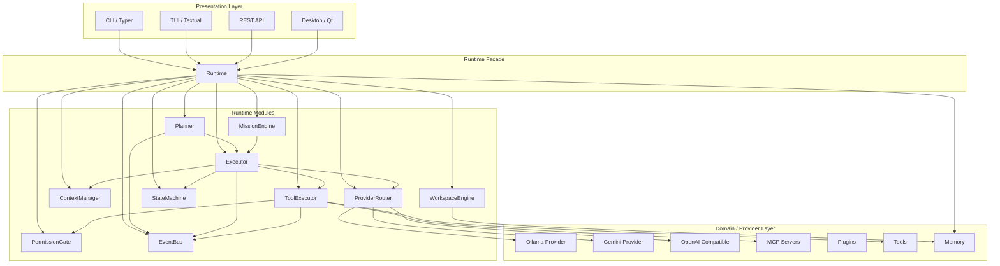
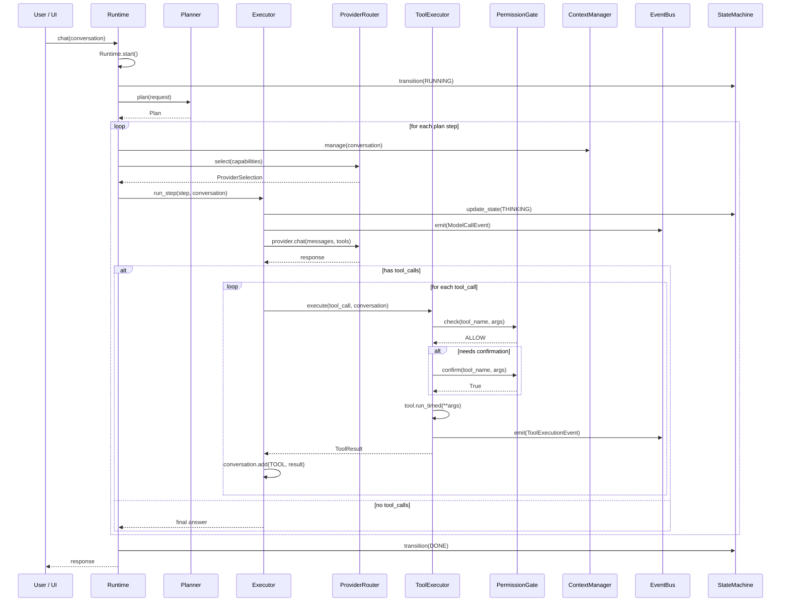
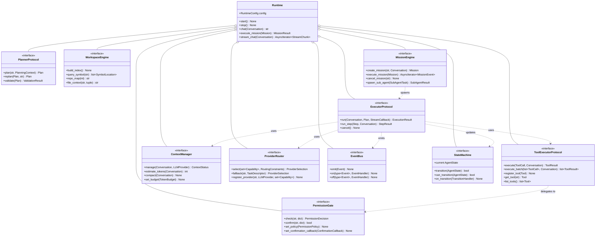

# AIOS Runtime Architecture

## 1. Vision: The Runtime Layer

Today AIOS is a CLI application. The `ExecutionEngine` monolith is tightly coupled to `aios.executor`, `aios.providers`, `aios.tools`, `aios.permissions`, `aios.hooks`, `aios.memory`, `aios.mcp`, `aios.plugins`, `aios.context`, `aios.cli.branding` — 10+ packages imported into a single file.

The target introduces a **`aios.runtime`** package that owns all agent orchestration. It exposes a single `Runtime` facade with no dependency on any presentation layer. This allows CLI, TUI, Desktop (Qt/wx), IDE extension, REST API, and Voice interfaces to share the same runtime logic.

```
┌─────────────────────────────────────────────────────┐
│                   PRESENTATION                       │
│  ┌──────┐  ┌──────┐  ┌────────┐  ┌────┐  ┌──────┐  │
│  │ CLI  │  │ TUI  │  │ Desktop│  │ API│  │ Voice│  │
│  └──┬───┘  └──┬───┘  └───┬────┘  └──┬─┘  └──┬───┘  │
│     │         │           │          │        │      │
├─────┼─────────┼───────────┼──────────┼────────┼──────┤
│     │         │           │          │        │      │
│     ▼         ▼           ▼          ▼        ▼      │
│  ┌─────────────────────────────────────────────┐    │
│  │               aiOS RUNTIME                   │    │
│  │  ┌──────────┐ ┌──────────┐ ┌──────────────┐ │    │
│  │  │  Runtime │ │Planner   │ │MissionEngine │ │    │
│  │  │  (Facade)│ │          │ │              │ │    │
│  │  └──────────┘ └──────────┘ └──────────────┘ │    │
│  │  ┌──────────┐ ┌──────────┐ ┌──────────────┐ │    │
│  │  │ Executor │ │ToolExec  │ │PermissionGate│ │    │
│  │  └──────────┘ └──────────┘ └──────────────┘ │    │
│  │  ┌──────────┐ ┌──────────┐ ┌──────────────┐ │    │
│  │  │ProvRouter│ │CtxManager│ │WorkspaceEng  │ │    │
│  │  └──────────┘ └──────────┘ └──────────────┘ │    │
│  │  ┌──────────┐ ┌──────────┐                   │    │
│  │  │EventBus  │ │StateMach │                   │    │
│  │  └──────────┘ └──────────┘                   │    │
│  └─────────────────────────────────────────────┘    │
├─────────────────────────────────────────────────────┤
│                   DOMAIN / PROVIDERS                 │
│  ┌────────┐ ┌────────┐ ┌────────┐ ┌──────────────┐ │
│  │Ollama  │ │Gemini  │ │OpenAI  │ │PluginProvs   │ │
│  └────────┘ └────────┘ └────────┘ └──────────────┘ │
│  ┌────────┐ ┌────────┐ ┌────────┐                   │
│  │MCP Svr │ │Plugins │ │Tools   │                   │
│  └────────┘ └────────┘ └────────┘                   │
└─────────────────────────────────────────────────────┘
```

---

## 2. Package Structure

```
src/aios/
├── runtime/                        # NEW — the Runtime layer
│   ├── __init__.py                 # exports Runtime facade
│   ├── runtime.py                  # Runtime: the single entry point
│   ├── planner/
│   │   ├── __init__.py
│   │   ├── base.py                 # PlannerProtocol, Plan, Step
│   │   ├── sequential.py           # SequentialPlanner
│   │   └── hierarchical.py         # (future) HierarchicalPlanner
│   ├── executor/
│   │   ├── __init__.py
│   │   ├── base.py                 # ExecutorProtocol
│   │   ├── loop.py                 # AgentLoopExecutor (think → tool → loop)
│   │   └── streaming.py            # StreamingExecutor
│   ├── tool_executor/
│   │   ├── __init__.py
│   │   ├── base.py                 # ToolExecutorProtocol
│   │   └── executor.py             # ToolExecutor
│   ├── permission_gate/
│   │   ├── __init__.py             # PermissionGate facade
│   │   └── gate.py                 # PermissionGate — wraps PermissionManager
│   ├── context_manager/
│   │   ├── __init__.py             # ContextManager facade
│   │   └── manager.py              # ContextManager — budget + window + compactor
│   ├── provider_router/
│   │   ├── __init__.py
│   │   ├── base.py                 # RoutingProtocol, ModelCapability
│   │   ├── router.py               # ProviderRouter
│   │   └── costing.py              # CostTracker
│   ├── workspace_engine/
│   │   ├── __init__.py
│   │   ├── base.py                 # WorkspaceProtocol
│   │   └── engine.py               # WorkspaceEngine (symbol index, repo map)
│   ├── mission_engine/
│   │   ├── __init__.py
│   │   ├── base.py                 # MissionProtocol, Mission, MissionStatus
│   │   └── engine.py               # MissionEngine (multi-step, sub-agents)
│   ├── event_bus/
│   │   ├── __init__.py
│   │   ├── base.py                 # Event, EventHandler
│   │   └── bus.py                  # EventBus
│   ├── state_machine/
│   │   ├── __init__.py
│   │   ├── base.py                 # State, Transition, StateMachineProtocol
│   │   └── machine.py              # StateMachine
│   └── models/
│       ├── __init__.py
│       ├── plan.py                 # Plan, Step, StepStatus
│       ├── mission.py              # Mission, MissionStep, MissionResult
│       └── routing.py              # ModelCapability, RoutingDecision
│
├── cli/                            # CLI — thin presentation only
│   ├── main.py                     # → delegates to Runtime
│   ├── slash.py
│   ├── branding.py
│   └── tui/
├── core/
│   └── models.py                   # Conversation, Message, Role, etc.
├── providers/                      # UNCHANGED — domain layer
├── tools/                          # UNCHANGED — domain layer
├── permissions/                    # UNCHANGED — domain layer
├── hooks/                          # UNCHANGED — domain layer
├── plugins/                        # UNCHANGED — domain layer
├── mcp/                            # UNCHANGED — domain layer
├── memory/                         # UNCHANGED — domain layer
├── context/                        # TO BE DEPRECATED — replaced by runtime/context_manager/
├── workspace/                      # TO BE DEPRECATED — replaced by runtime/workspace_engine/
└── config/
    └── settings.py
```

---

## 3. Module Boundaries & Interfaces

### 3.1 Runtime Facade

```python
@runtime_protocol
class Runtime:
    """Single entry point. All presentation layers talk to this."""

    def __init__(self, config: RuntimeConfig) -> None: ...
    async def start(self) -> None: ...
    async def stop(self) -> None: ...

    # Capabilities
    @property
    def planner(self) -> PlannerProtocol: ...
    @property
    def executor(self) -> ExecutorProtocol: ...
    @property
    def tool_executor(self) -> ToolExecutorProtocol: ...
    @property
    def permission_gate(self) -> PermissionGate: ...
    @property
    def context_manager(self) -> ContextManager: ...
    @property
    def provider_router(self) -> ProviderRouter: ...
    @property
    def workspace_engine(self) -> WorkspaceEngine: ...
    @property
    def mission_engine(self) -> MissionEngine: ...
    @property
    def event_bus(self) -> EventBus: ...
    @property
    def state_machine(self) -> StateMachine: ...

    # High-level operations
    async def chat(self, conversation: Conversation) -> str: ...
    async def execute_mission(self, mission: Mission) -> MissionResult: ...
    async def execute_plan(self, plan: Plan) -> str: ...
    async def stream_chat(self, conversation: Conversation) -> AsyncIterator[StreamChunk]: ...
```

### 3.2 Planner

```python
@runtime_protocol
class PlannerProtocol:
    """Decomposes a user request into a sequence of executable steps."""

    async def plan(self, request: str, context: PlanningContext) -> Plan: ...
    async def replan(self, plan: Plan, feedback: str) -> Plan: ...
    async def validate(self, plan: Plan) -> ValidationResult: ...

@dataclass
class Step:
    id: str
    description: str
    tool: str | None          # None = LLM-only step
    args: dict[str, Any] | None
    dependencies: list[str]   # step IDs that must complete first
    expected_outcome: str
    status: StepStatus

@dataclass
class Plan:
    id: str
    goal: str
    steps: list[Step]
    created_at: float
    parallel_groups: list[list[str]]  # steps that can run concurrently
```

### 3.3 Executor

```python
@runtime_protocol
class ExecutorProtocol:
    """Orchestrates the think → act → observe agent loop."""

    async def run(
        self,
        conversation: Conversation,
        plan: Plan | None = None,
        stream_callback: StreamCallback | None = None,
    ) -> ExecutionResult: ...

    async def run_step(
        self,
        step: Step,
        conversation: Conversation,
    ) -> StepResult: ...

    async def cancel(self) -> None: ...
```

### 3.4 ToolExecutor

```python
@runtime_protocol
class ToolExecutorProtocol:
    """Executes a single tool call with permission gating and result handling."""

    async def execute(
        self,
        tool_call: ToolCall,
        conversation: Conversation,
    ) -> ToolResult: ...

    async def execute_batch(
        self,
        tool_calls: list[ToolCall],
        conversation: Conversation,
    ) -> list[ToolResult]: ...

    def register_tool(self, tool: Tool) -> None: ...
    def get_tool(self, name: str) -> Tool | None: ...
    def list_tools(self) -> list[Tool]: ...
```

### 3.5 PermissionGate

```python
@runtime_protocol
class PermissionGate:
    """Decides whether a tool call is allowed."""

    async def check(
        self,
        tool_name: str,
        args: dict[str, Any],
    ) -> PermissionDecision: ...

    async def confirm(
        self,
        tool_name: str,
        args: dict[str, Any],
    ) -> bool: ...

    def set_policy(self, policy: PermissionPolicy) -> None: ...
    def set_confirmation_callback(self, callback: ConfirmationCallback) -> None: ...
```

### 3.6 ContextManager

```python
@runtime_protocol
class ContextManager:
    """Manages token budget, sliding window, and summarization."""

    async def manage(
        self,
        conversation: Conversation,
        provider: LLMProvider,
    ) -> ContextStatus: ...

    async def estimate_tokens(self, conversation: Conversation) -> int: ...
    async def compact(self, conversation: Conversation) -> None: ...
    def set_budget(self, budget: TokenBudget) -> None: ...
```

### 3.7 ProviderRouter

```python
@runtime_protocol
class ProviderRouter:
    """Selects the optimal provider/model for a given task."""

    async def select(
        self,
        capabilities: set[Capability],
        constraints: RoutingConstraints,
    ) -> ProviderSelection: ...

    async def fallback(
        self,
        failed_provider: str,
        task: TaskDescriptor,
    ) -> ProviderSelection: ...

    def register_provider(
        self,
        name: str,
        provider: LLMProvider,
        capabilities: set[Capability],
    ) -> None: ...

    @dataclass
    class ProviderSelection:
        provider_name: str
        model_name: str
        provider_instance: LLMProvider
        estimated_cost: float
        estimated_tokens: int

    @dataclass
    class RoutingConstraints:
        max_cost: float | None = None
        preferred_provider: str | None = None
        requires_streaming: bool = False
        requires_vision: bool = False
        requires_tools: bool = True
        max_latency_ms: int | None = None

@dataclass(frozen=True)
class ModelCapability:
    vision: bool = False
    tools: bool = True
    streaming: bool = True
    max_tokens: int = 128_000
    max_output_tokens: int = 4_096
    supports_structured_output: bool = False
    context_window: int = 128_000
    cost_per_million_input: float = 0.0
    cost_per_million_output: float = 0.0
    latency_p50_ms: float = 1_000.0
```

### 3.8 WorkspaceEngine

```python
@runtime_protocol
class WorkspaceEngine:
    """Provides workspace intelligence: symbol index, file map, change tracking."""

    async def build_index(self) -> None: ...
    async def query_symbol(self, symbol: str) -> list[SymbolLocation]: ...
    async def repo_map(self, max_tokens: int = 1_024) -> str: ...
    async def file_context(self, path: str, lines: tuple[int, int]) -> str: ...

    def set_root(self, path: Path) -> None: ...
    def is_ignored(self, path: Path) -> bool: ...

@dataclass
class SymbolLocation:
    symbol: str
    kind: str  # "class", "function", "variable", "import"
    file_path: str
    line: int
    column: int
```

### 3.9 MissionEngine

```python
@runtime_protocol
class MissionEngine:
    """Manages long-running autonomous missions with sub-agents."""

    async def create_mission(
        self, goal: str, conversation: Conversation
    ) -> Mission: ...

    async def execute_mission(
        self, mission: Mission
    ) -> AsyncIterator[MissionEvent]: ...

    async def cancel_mission(self, mission_id: str) -> None: ...
    async def get_status(self, mission_id: str) -> MissionStatus: ...
    async def spawn_sub_agent(self, task: SubAgentTask) -> SubAgentResult: ...
```

### 3.10 EventBus

```python
@runtime_protocol
class EventBus:
    """Typed event bus for runtime-internal and presentation communication."""

    async def emit(self, event: Event) -> None: ...
    def on(self, event_type: type[Event], handler: EventHandler) -> None: ...
    def off(self, event_type: type[Event], handler: EventHandler) -> None: ...

@dataclass
class Event:
    source: str
    timestamp: float
    payload: Any

@dataclass
class ToolExecutionEvent(Event):
    tool_name: str
    args: dict
    result: ToolResult
    duration_ms: float

@dataclass
class ModelCallEvent(Event):
    provider: str
    model: str
    input_tokens: int
    output_tokens: int
    duration_ms: float

@dataclass
class StateChangeEvent(Event):
    old_state: AgentState
    new_state: AgentState
```

### 3.11 StateMachine

```python
@runtime_protocol
class StateMachine:
    """Deterministic finite state machine for the agent loop."""

    @property
    def current(self) -> AgentState: ...
    async def transition(self, target: AgentState) -> bool: ...
    def can_transition(self, target: AgentState) -> bool: ...
    def on_transition(self, handler: TransitionHandler) -> None: ...
    def reset(self) -> None: ...
```

---

## 4. Component Diagrams

### 4.1 Runtime Internal Architecture



### 4.2 Agent Loop Sequence



### 4.3 Class Hierarchy for Key Abstractions



---

## 5. Dependency Graph & Layering Rules

### 5.1 Strict Dependency Direction

```
┌─────────────────────────────────────┐
│           PRESENTATION              │
│  cli/, tui/, api/, desktop/         │
├─────────────────────────────────────┤
│           RUNTIME                   │
│  runtime/                           │
│  runtime/planner/                   │
│  runtime/executor/                  │
│  runtime/tool_executor/             │
│  runtime/permission_gate/           │
│  runtime/context_manager/           │
│  runtime/provider_router/           │
│  runtime/workspace_engine/          │
│  runtime/mission_engine/            │
│  runtime/event_bus/                 │
│  runtime/state_machine/             │
│  runtime/models/                    │
├─────────────────────────────────────┤
│  ┌──────────────────────────────┐   │
│  │        DOMAIN LAYER          │   │
│  │  core/, config/              │   │
│  │  providers/, tools/          │   │
│  │  permissions/, hooks/        │   │
│  │  plugins/, mcp/, memory/     │   │
│  │  workspace/, context/        │   │
│  └──────────────────────────────┘   │
└─────────────────────────────────────┘
```

### 5.2 Dependency Rules

| Rule | Statement | Enforcement |
|------|-----------|-------------|
| **R1** | Presentation layer MUST depend only on `runtime.Runtime` facade | Import check in CI |
| **R2** | Runtime modules MUST NOT import from `aios.cli`, `aios.cli.tui`, or any presentation package | Linter rule |
| **R3** | Runtime modules MAY import from `aios.core`, `aios.config` | Allowed |
| **R4** | Runtime modules MAY import from `aios.runtime.models` | Allowed |
| **R5** | Runtime/planner MAY depend on runtime/executor | One-way only |
| **R6** | Runtime/executor MUST NOT depend on runtime/planner | Linter rule |
| **R7** | Runtime/executor MAY depend on runtime/tool_executor, runtime/provider_router, runtime/context_manager, runtime/event_bus, runtime/state_machine | Allowed |
| **R8** | Runtime/tool_executor MUST NOT depend on runtime/executor | Linter rule |
| **R9** | Runtime/permission_gate MUST NOT depend on any other runtime module except runtime/models | Isolated by design |
| **R10** | Domain layer modules MUST NOT import from runtime/ | Strict |
| **R11** | All domain layer dependencies flow through ProviderRouter (for providers) and ToolExecutor (for tools) | No direct provider references in runtime core |

### 5.3 Cross-Cutting Concerns

```
EventBus ──► ALL runtime modules      (publish/subscribe)
StateMachine ──► Executor, ToolExecutor  (state transitions)
ContextManager ──► Executor            (budget enforcement)
Runtime ──► ALL runtime modules        (facade delegates)
Core Models ──► Runtime models         (shared data types)
```

---

## 6. Architecture Decision Records

### ADR-001: Runtime Facade Pattern

**Status:** Accepted

**Context:** Multiple future interfaces (CLI, TUI, API, Desktop, Voice) must share agent orchestration logic without duplicating code.

**Decision:** Introduce `Runtime` as a facade class in `aios/runtime/runtime.py`. All presentation layers construct a `Runtime` instance via `RuntimeConfig` and call only its methods. Internally, `Runtime` lazily initializes all sub-modules and wires their dependencies.

**Consequences:**
- Positive: Single `Runtime.stop()` call cleans up all connections, processes, sub-agents
- Positive: Swap presentation layer without touching agent logic
- Positive: Unit-testable — create Runtime with mock sub-modules
- Negative: Runtime becomes a God Object if not disciplined — mitigated by delegating to interfaces

### ADR-002: Protocol-Based Module Boundaries

**Status:** Accepted

**Context:** Runtime modules need loose coupling to allow independent testing, swapping implementations, and parallel development.

**Decision:** Every module exports a `Protocol` (Python's `typing.Protocol`) as its public interface. The Runtime facade depends on protocols, not concrete implementations. Concrete implementations are registered via dependency injection in `Runtime.__init__()`.

**Consequences:**
- Positive: Any module can be mocked with `unittest.mock.AsyncMock(spec=Protocol)`
- Positive: `WorkspaceEngine` can start with ctags, swap to tree-sitter later
- Positive: New `ProviderRouter` strategies (cost-first, latency-first) are drop-in replacements
- Negative: Extra indirection — mitigated by keeping protocols narrow (3-5 methods)

### ADR-003: EventBus for Cross-Module Communication

**Status:** Accepted

**Context:** Modules like ToolExecutor, Executor, PermissionGate, and external presentation layers need to observe and react to events without direct method calls.

**Decision:** Every runtime module emits structured events via EventBus. The EventBus is async-first and supports typed event filtering. The Presentation layer subscribes to events for UI updates.

**Consequences:**
- Positive: The TUI can subscribe to `ToolExecutionEvent` for progress display without coupling to ToolExecutor
- Positive: The CLI can subscribe to `ModelCallEvent` for cost tracking
- Positive: Plugins can observe events without being wired into the execution loop
- Negative: Eventual consistency — events are fire-and-forget. For critical paths (permission denial), direct return values remain the mechanism.

### ADR-004: Planner-Executor Separation

**Status:** Accepted

**Context:** Current `ExecutionEngine.run()` interleaves planning (loop iteration decisions) with execution. This prevents plan-then-execute workflows, pre-execution review, and parallel step execution.

**Decision:** `Planner` produces a `Plan` (list of `Step` objects with dependency graph). `Executor` executes steps according to the plan. The Planner can be bypassed for simple chat (pass `plan=None` to `Executor.run()`). For mission mode, Planner can decompose a goal into sub-tasks.

**Consequences:**
- Positive: Enables "show plan → approve → execute" review workflow
- Positive: Enables parallel step execution (Planner annotates `parallel_groups`)
- Positive: Enables replanning mid-execution (Planner.replan())
- Positive: Simple chat doesn't require planning — executor falls back to single-step
- Negative: Extra latency for the initial plan generation — mitigated by streaming plan tokens

### ADR-005: ProviderRouter with Capability Matrix

**Status:** Accepted

**Context:** Current code has hardcoded provider selection in `cli/main.py` with no fallback, no capability awareness. Users must manually choose provider/model for each task.

**Decision:** `ProviderRouter` maintains a registry of `(provider, model, capabilities)` tuples. When `select()` is called with required capabilities + constraints, it returns the optimal match. On failure, `fallback()` selects the next best option. Capabilities include vision, tools, streaming, context window, max tokens, cost, latency.

**Consequences:**
- Positive: "Use cheapest model with vision support" becomes a 1-line call
- Positive: Automatic fallback on rate limits or model failures
- Positive: Mission mode can route sub-tasks to different models (cheap for search, expensive for code gen)
- Negative: Capability declarations must be maintained — mitigated by provider defaults in catalog

### ADR-006: MissionEngine as Top-Level Orchestrator

**Status:** Accepted

**Context:** Users need to define goals ("Implement login feature") that the system decomposes into sub-tasks, executes them, and reports progress — with the ability to run sub-tasks in parallel, retry failures, and checkpoint progress.

**Decision:** `MissionEngine` manages the mission lifecycle: create → plan → execute (with sub-agent spawning) → report. Each `Mission` has a `Plan` managed by `Planner`, and execution is delegated to `Executor` via `MissionEngine`. Sub-agents run as isolated `Runtime` instances with their own conversation and tool registry.

**Consequences:**
- Positive: Long-running missions survive transient failures via checkpoint/resume
- Positive: Sub-agents can be given restricted tool/permission scopes
- Positive: MissionEngine orchestrates rather than implements — delegates to Planner, Executor, ProviderRouter
- Negative: Sub-agent orchestration adds overhead — only for missions, not single-turn chat

### ADR-007: Stratified Migration

**Status:** Accepted

**Context:** Rewriting the entire codebase in one step is risky. The new Runtime package must coexist with the old code during migration.

**Decision:** Migration happens in 3 phases:
1. **Add** — create `aios/runtime/` alongside existing code. New Runtime modules import from existing domain packages.
2. **Shift** — one by one, reduce `ExecutionEngine` responsibilities by delegating to Runtime modules.
3. **Remove** — delete ExecutionEngine, delete `aios/context/`, `aios/workspace/` if fully replaced.

Each phase is reversible — if a Runtime module causes issues, revert to the monolithic path via feature flag.

**Consequences:**
- Positive: Each module can be extracted, tested, and verified independently
- Positive: The existing test suite (167 tests) validates that migration doesn't break behavior
- Negative: Temporary duplication of interfaces — acceptable during transition

### ADR-008: Async-First Throughout

**Status:** Accepted

**Context:** The agent loop is inherently async (LLM calls, tool execution, MCP streaming). The current code already uses `async/await` but inconsistently (some sync callbacks, some sync permission checks).

**Decision:** Every Runtime module method is async. Callbacks (`ConfirmationCallback`, `StateCallback`, `StreamCallback`) are `Awaitable`. The EventBus is fully async.

**Consequences:**
- Positive: No blocking calls in the hot loop
- Positive: Sub-agents can run concurrently via `asyncio.gather()`
- Positive: Clean cancellation via `asyncio.CancelledError`
- Negative: Slightly more complex error handling — mitigated by structured EventBus error events

---

## 7. Migration Plan

### Phase 1 — Foundation (Week 1-2)

| Step | Action | Files | Tests |
|------|--------|-------|-------|
| 1.1 | Create `aios/runtime/` package with `__init__`, `models/`, `event_bus/`, `state_machine/` | 6 new files | Test EventBus emit/subscribe, StateMachine transitions |
| 1.2 | Extract `ProviderRouter` from `providers/registry.py` | `runtime/provider_router/`, update `providers/registry.py` to delegate | All existing provider tests pass unchanged |
| 1.3 | Extract `ToolExecutor` from `ExecutionEngine.run()` (lines 199-273) | `runtime/tool_executor/executor.py` | Engine tests pass — Engine calls ToolExecutor internally |
| 1.4 | Extract `PermissionGate` wrapping `PermissionManager` | `runtime/permission_gate/gate.py` | Permission tests pass unchanged |

**Verification gate:** All 167 existing tests pass. Runtime modules have 20+ new unit tests.

### Phase 2 — Decomposition (Week 3-4)

| Step | Action | Files | Tests |
|------|--------|-------|-------|
| 2.1 | Extract `ContextManager` from `context/manager.py` + `compactor.py` + `budget.py` + `window.py` | `runtime/context_manager/`, deprecate `aios/context/` | Context tests run against both old and new |
| 2.2 | Create `Runtime` facade | `runtime/runtime.py` | Runtime integration test with mock modules |
| 2.3 | Extract `Planner` (simple sequential from Executor loop logic) | `runtime/planner/` | Planner tests — plan/replan/validate |
| 2.4 | Create `Executor` (thin loop, delegates to ToolExecutor, ProviderRouter, ContextManager) | `runtime/executor/loop.py` | Engine tests run via Executor instead of ExecutionEngine |

**Verification gate:** CLI `ask` command can run via `Runtime` facade behind a feature flag. 80% of engine logic lives in Runtime modules.

### Phase 3 — Intelligence (Week 5-6)

| Step | Action | Files | Tests |
|------|--------|-------|-------|
| 3.1 | Implement `WorkspaceEngine` with ctags-based symbol index | `runtime/workspace_engine/` | Index build + query tests |
| 3.2 | Implement `MissionEngine` with sub-agent spawning | `runtime/mission_engine/` | Mission lifecycle tests |
| 3.3 | Wire Planner into `Runtime` for plan-review-execute flow | Update `Runtime` | End-to-end mission test |
| 3.4 | Add `--plan` flag to CLI (plan-only mode, no execution) | `cli/main.py` (2 lines) | Manual + integration |

**Verification gate:** `aios --plan "Refactor X"` shows a plan. `aios --mission "Implement Y"` executes multi-step mission.

### Phase 4 — Cleanup (Week 7)

| Step | Action | Files | Tests |
|------|--------|-------|-------|
| 4.1 | Remove `ExecutionEngine` — last callers switch to `Runtime.executor` | Delete `executor/engine.py` | All tests updated |
| 4.2 | Remove `aios/context/` — all users on `Runtime.context_manager` | Delete directory | All tests updated |
| 4.3 | Remove `aios/workspace/` — replaced by `WorkspaceEngine` | Delete directory | All tests updated |
| 4.4 | Remove dead code paths from main.py (deprecated agent creation) | Update `cli/main.py` | CLI integration tests pass |

**Verification gate:** Zero imports from `executor.engine`, `context.manager`, `workspace.context` outside `runtime/`.

---

## 8. Interface Contract Summary

| Module | Imports From | Does Not Import From | Key Protocol Method Count |
|--------|-------------|---------------------|--------------------------|
| `runtime.Runtime` | `runtime.*` protocols, `core.models`, `config` | `cli.*`, `tui.*`, any domain impl | 15+ |
| `runtime/planner` | `runtime/models`, `runtime/executor` | `cli.*`, `tui.*`, domain impls | 3 |
| `runtime/executor` | `runtime/*` (all), `core/models`, `tools` | `cli.*`, `tui.*` | 3 |
| `runtime/tool_executor` | `runtime/permission_gate`, `core/models`, `tools` | `runtime/executor`, `cli.*`, `tui.*` | 4 |
| `runtime/permission_gate` | `runtime/models`, `permissions/*` | Any other runtime module | 4 |
| `runtime/context_manager` | `runtime/models`, `core/models`, `context/*` | `cli.*`, `tui.*` | 4 |
| `runtime/provider_router` | `runtime/models`, `providers/*`, `config` | `cli.*`, `tui.*` | 3 |
| `runtime/workspace_engine` | `runtime/models`, `memory/*` | `cli.*`, `tui.*` | 5 |
| `runtime/mission_engine` | `runtime/*` (all), `core/models` | `cli.*`, `tui.*` | 4 |
| `runtime/event_bus` | `runtime/models` | `cli.*`, `tui.*`, any domain impl | 3 |
| `runtime/state_machine` | `runtime/models` | `cli.*`, `tui.*`, any domain impl | 4 |

---

## 9. Performance & Scalability Notes

- **ProviderRouter caching:** `ProviderSelection` results cached for 60s with TTL. Prevents re-selecting on every loop iteration.
- **ToolExecutor parallelism:** `execute_batch()` uses `asyncio.gather()` for independent tool calls (identified by Planner's `parallel_groups`).
- **WorkspaceEngine indexing:** Async background indexing on `Runtime.start()`. Index is persisted to `.aios/index/` SQLite.
- **MissionEngine checkpoints:** State serialized to `memory/history.py` after each step. Resume from last checkpoint on restart.
- **EventBus backpressure:** Events are queued in `asyncio.Queue(maxsize=1_000)`. Blocking emit warns on overflow.
- **ContextManager budget enforcement:** Configurable hard/soft limits. Soft limit triggers compaction, hard limit blocks execution.

---

## 10. Risk Register

| Risk | Likelihood | Impact | Mitigation |
|------|-----------|--------|------------|
| Runtime facade becomes God Object | Medium | High | Strict protocol boundaries, cyclomatic complexity CI gate (< 15 per module) |
| Migration breaks existing CLI behavior | High | Critical | Feature flags for each phase, all 167 tests must pass at every commit |
| ProviderRouter capability matrix is incomplete | Medium | Medium | Extensible `Capability` enum with fallback to "unknown" defaults |
| WorkspaceEngine index drift (stale symbol locations) | Medium | Low | Index is advisory — symbol lookup failure falls back to grep |
| MissionEngine sub-agent resource leaks | Low | High | Mandatory `Runtime.stop()` in `__aexit__`; timeout-based sub-agent termination |
| EventBus memory leak from unregistered handlers | Low | Low | WeakRef handlers, periodic GC of orphaned subscriptions |
