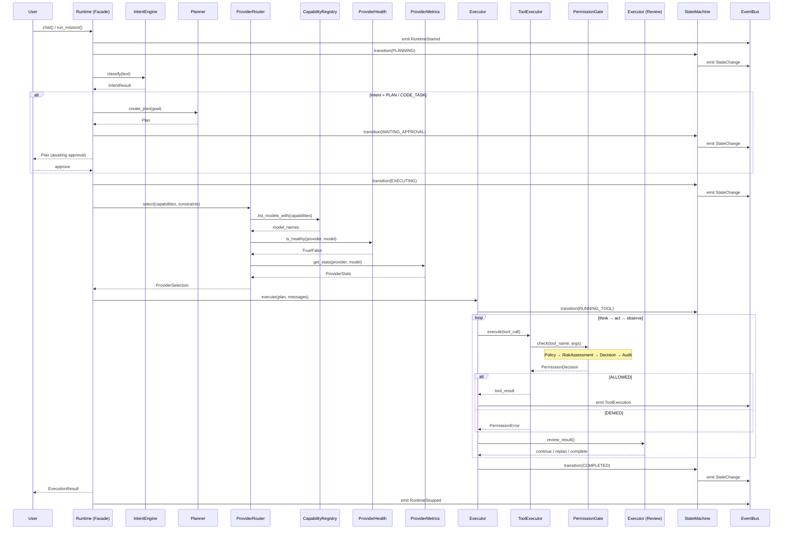

# Runtime v2 — Implementation Plan

## 0. Proposed Architects — Missing Components

After reviewing every current module interface, I propose **two additional architectural components** beyond the 11 already specified:

### 0.1 MemoryOrchestrator

**Why separate from ContextManager:** Today `ExecutionEngine.run()` injects project memory (AIOS.md), auto memory, and the system prompt inline in 30 lines of sequential code. There's no abstraction for memory assembly, and no separation between "what to remember" and "how to fit it in the context window."

**Responsibility:** Composes all memory sources (project AIOS.md, auto facts, conversation history, global config) into a structured memory prompt. Supports pluggable memory sources.

### 0.2 PromptAssembler

**Why separate:** Currently `ExecutionEngine.run()` builds the system prompt, injects memory, appends workspace info, and injects memory all in one block (lines 125-139). This is a distinct concern from context management. The PromptAssembler owns prompt construction; ContextManager owns token budget enforcement.

**Responsibility:** Builds the final message array for the LLM call by composing system prompt, memory context, workspace info, tool definitions, and conversation history. Applies template injection.

### 0.3 IntentEngine

**Why it matters:** Today intent is decided by `cli/slash.py` (starts with `/`) and the CLI `chat` vs `code` commands. A Runtime cannot hardcode slash commands. More critically, many user requests ("git status", "open VSCode", "run tests", "browse files") are deterministic and should never touch an LLM. IntentEngine must be a **pluggable processing pipeline**, not a single classifier.

**Architecture — Pluggable 4-stage pipeline:**

```
User Input
    │
    ▼
┌─────────────────┐
│ 1. Rule Engine   │ ─── Handles deterministic patterns (regex, prefix, keyword)
│                  │     "git status" → Intent(COMMAND, git_status)
│                  │     "open VSCode" → Intent(COMMAND, open_app)
└────────┬────────┘
         │ unhandled
         ▼
┌─────────────────┐
│ 2. Local         │ ─── (future) On-device ML classifier for fast offline routing
│    Classifier    │
└────────┬────────┘
         │ unhandled
         ▼
┌─────────────────┐
│ 3. Planner       │ ─── Multi-step requests ("refactor login to use JWT")
│                  │     Requires decomposition → delegates to Planner
└────────┬────────┘
         │ unhandled
         ▼
┌─────────────────┐
│ 4. LLM           │ ─── Free-form chat. Last resort for ambiguous input.
│    (fallback)    │     "what do you think about..." → Intent(CHAT)
└─────────────────┘
```

Each stage implements `IntentStage(Protocol)` with `can_handle(text) → bool` and `handle(text) → IntentResult`. Stages register in priority order. The first stage that returns `handled=True` wins.

### 0.4 Expanded Module Set

```
runtime/
├── Runtime               # Facade — the single entry point
├── Planner               # Decomposes requests into Plans
├── Executor              # Agent loop (think → act → observe)
├── ToolExecutor          # Executes tool calls with permission gating
├── PermissionGate        # Policy → RiskAssessment → Decision → Audit
├── ContextManager        # Token budget + window + compaction
├── ProviderRouter        # Thin orchestration layer (queries 3 sub-services)
├── CapabilityRegistry    # Model capabilities (model-centric, not provider)
├── ProviderHealth        # Runtime health tracking (failures, latency, retries)
├── ProviderMetrics       # Cost, token usage, performance statistics
├── WorkspaceKnowledge    # Symbol index, deps, frameworks, git, file queries
├── MissionEngine         # Multi-step autonomous missions
├── IntentEngine          # Input classification and routing
├── MemoryOrchestrator    # Composes memory sources
├── PromptAssembler       # Builds the final prompt/message array
├── EventBus              # Typed pub/sub
├── StateMachine          # Deterministic FSM
```

---

## 1. Complete Interface Contracts

### 1.1 Runtime

```python
# src/aios/runtime/runtime.py

@dataclass
class RuntimeConfig:
    provider_configs: list[ProviderConfig]
    default_provider: str = "openai"
    default_model: str = "gpt-4o"
    token_limit: int = 128_000
    workspace_root: Path | None = None
    system_prompt: str | None = None
    permission_profile: str = "trusted"
    git_config: GitConfig | None = None
    mcp_servers: list[dict] | None = None
    confirmation_callback: ConfirmationCallback | None = None
    state_callback: StateCallback | None = None


class Runtime:
    """
    Single entry point for all AIOS operations.

    Owns lifecycle of all Runtime modules. Presentation layers (CLI, TUI,
    API, Desktop, Voice) construct a Runtime via RuntimeConfig and call
    its methods. Runtime wires sub-module dependencies on construction.
    """

    def __init__(self, config: RuntimeConfig) -> None: ...

    # ── Lifecycle ──────────────────────────────────────────────────────
    async def start(self) -> None:
        """Initialize all sub-modules, connect MCP, build workspace index."""

    async def stop(self) -> None:
        """Disconnect MCP, unload plugins, persist memory, close providers."""

    async def __aenter__(self) -> Runtime: ...
    async def __aexit__(self, *args) -> None: ...

    # ── Module access (dependency injection ready) ─────────────────────
    @property
    def planner(self) -> PlannerProtocol: ...
    @property
    def executor(self) -> ExecutorProtocol: ...
    @property
    def tool_executor(self) -> ToolExecutorProtocol: ...
    @property
    def permission_gate(self) -> PermissionGateProtocol: ...
    @property
    def context_manager(self) -> ContextManagerProtocol: ...
    @property
    def provider_router(self) -> ProviderRouterProtocol: ...
    @property
    def workspace_knowledge(self) -> WorkspaceKnowledgeProtocol: ...
    @property
    def mission_engine(self) -> MissionEngineProtocol: ...
    @property
    def intent_engine(self) -> IntentEngineProtocol: ...
    @property
    def memory_orchestrator(self) -> MemoryOrchestratorProtocol: ...
    @property
    def prompt_assembler(self) -> PromptAssemblerProtocol: ...
    @property
    def event_bus(self) -> EventBusProtocol: ...
    @property
    def state_machine(self) -> StateMachineProtocol: ...

    # ── High-level operations ──────────────────────────────────────────
    async def chat(
        self,
        conversation: Conversation,
        stream_callback: StreamCallback | None = None,
    ) -> str:
        """
        Single-turn or multi-turn chat. No planning — the executor
        runs the agent loop until the LLM provides a final answer.
        """

    async def execute_plan(
        self,
        plan: Plan,
        conversation: Conversation,
        stream_callback: StreamCallback | None = None,
    ) -> ExecutionResult:
        """
        Execute a pre-defined Plan. Used after Planner.plan() + user review.
        """

    async def run_mission(
        self,
        goal: str,
        conversation: Conversation,
    ) -> AsyncIterator[MissionEvent]:
        """
        Decompose goal → plan → execute each step. Yields progress events.
        """

    async def classify_intent(
        self,
        text: str,
    ) -> Intent: ...

    # ── Direct delegate passthroughs ───────────────────────────────────
    async def build_index(self) -> None:
        """Delegates to WorkspaceKnowledge.build_index()."""
    async def add_fact(self, fact: str, source: str = "agent") -> None:
        """Delegates to MemoryOrchestrator.add_fact()."""
```

### 1.2 Planner

```python
# src/aios/runtime/planner/base.py

class PlannerProtocol(Protocol):
    """
    Decomposes a user request into an executable Plan.

    Strategy: the Planner calls the LLM with a structured prompt to
    produce the plan. The plan can be reviewed by the user before
    execution (plan → approve → execute flow).

    A simple chat has null plan — Executor falls back to single-step.
    """

    async def plan(
        self,
        request: str,
        context: PlanningContext,
    ) -> Plan: ...

    async def replan(
        self,
        plan: Plan,
        feedback: str,
    ) -> Plan:
        """
        Revise an existing plan based on mid-execution feedback or
        error recovery.
        """

    async def validate(
        self,
        plan: Plan,
    ) -> ValidationResult:
        """
        Pre-execution validation: detect circular dependencies,
        missing tool references, ambiguous steps.
        """


@dataclass(frozen=True)
class Step:
    id: str                         # Unique step identifier
    description: str                # Human-readable summary
    tool_name: str | None           # None = LLM-only reasoning step
    args: dict[str, Any] | None     # Tool arguments (if tool_name is set)
    dependencies: tuple[str, ...]   # Step IDs that must complete first
    expected_outcome: str           # Success criterion
    timeout_s: int = 60             # Per-step timeout


class StepStatus(StrEnum):
    PENDING = "pending"
    RUNNING = "running"
    SUCCEEDED = "succeeded"
    FAILED = "failed"
    SKIPPED = "skipped"
    CANCELLED = "cancelled"


@dataclass
class Plan:
    id: str
    goal: str                              # Original user request
    steps: list[Step]                      # Ordered steps
    parallel_groups: list[tuple[str, ...]] # Groups of steps that can run concurrently
    created_at: float
    status: PlanStatus = PlanStatus.PENDING

    def validate(self) -> ValidationResult: ...
    def steps_ready(self) -> list[Step]:
        """Steps whose dependencies are all SUCCEEDED."""


class PlanStatus(StrEnum):
    PENDING = "pending"
    APPROVED = "approved"
    RUNNING = "running"
    COMPLETED = "completed"
    FAILED = "failed"
    CANCELLED = "cancelled"


@dataclass
class PlanningContext:
    workspace_root: Path
    available_tools: list[str]
    conversation_history: str            # Last N messages as text
    max_steps: int = 10
    user_preferences: dict[str, Any] = field(default_factory=dict)
    mission_mode: bool = False           # True when under MissionEngine orchestration
    checkpoint_enabled: bool = False     # Enable mid-plan checkpoints


@dataclass
class ValidationResult:
    valid: bool
    errors: list[str]
    warnings: list[str]
```

### 1.3 Executor

```python
# src/aios/runtime/executor/base.py

class ExecutorProtocol(Protocol):
    """
    The core agent loop: think → act → observe, repeated until a
    terminal state is reached.

    When a Plan is provided, Executor walks through steps in order,
    respecting dependencies. When no plan is provided, Executor runs
    a free-form loop (LLM decides tool calls).
    """

    async def run(
        self,
        conversation: Conversation,
        plan: Plan | None = None,
        stream_callback: StreamCallback | None = None,
        max_iterations: int = 25,
    ) -> ExecutionResult:
        """
        Run the agent loop. If plan is provided, execute plan steps.
        Otherwise, run free-form until LLM returns no tool calls.
        """

    async def run_step(
        self,
        step: Step,
        conversation: Conversation,
    ) -> StepResult:
        """
        Execute a single Plan step. Calls LLM once, executes any tool
        calls that result, and returns the outcome.
        """

    async def cancel(self) -> None:
        """Cancel a running execution at the next safe checkpoint."""


@dataclass
class ExecutionResult:
    conversation: Conversation
    final_content: str
    iterations: int
    total_tokens: int
    total_cost: float
    duration_ms: float
    success: bool
    error: str | None = None


@dataclass
class StepResult:
    step_id: str
    status: StepStatus
    content: str
    tool_results: list[ToolResult]
    tokens_used: int
    duration_ms: float
    error: str | None = None
```

### 1.4 ToolExecutor

```python
# src/aios/runtime/tool_executor/base.py

class ToolExecutorProtocol(Protocol):
    """
    Executes tool calls with permission gating, timing, and result
    truncation. Owns the ToolRegistry.
    """

    async def execute(
        self,
        tool_call: ToolCall,
        tool_name: str,
        args: dict[str, Any],
        conversation: Conversation,
    ) -> ToolResult:
        """
        Single tool call: permission check → confirm → run → post-hook.
        """

    async def execute_batch(
        self,
        tool_calls: list[ToolCallDef],
        conversation: Conversation,
    ) -> list[ToolResult]:
        """
        Execute multiple tool calls. Respects ordering if any tool call
        is flagged as sequential (e.g., write-then-read).
        """

    def register_tool(self, tool: Tool) -> None: ...
    def register_mcp_tools(self, tools: list[Tool]) -> None: ...
    def get_tool(self, name: str) -> Tool | None: ...
    def list_tools(self) -> list[Tool]: ...


@dataclass
class ToolCall:
    id: str
    name: str
    args: dict[str, Any]
```

### 1.5 PermissionGate

```python
# src/aios/runtime/permission_gate/base.py

class PolicyProtocol(Protocol):
    """A permission policy that defines rules for tool execution."""

    @property
    def name(self) -> str: ...

    async def evaluate(
        self,
        tool_name: str,
        args: dict[str, Any],
        risk_level: RiskLevel,
    ) -> PermissionDecision: ...


class PermissionGateProtocol(Protocol):
    """
    Decides whether a tool call is allowed, denied, or requires
    user confirmation.

    Internal pipeline (implemented in Phase 2):

      1. Policy         — load applicable rules from the configured PolicyProtocol
      2. RiskAssessment — evaluate tool name + args → RiskLevel
      3. Decision       — apply policy + risk → PermissionDecision
      4. Audit          — log the decision to an in-memory audit trail

    Wraps the existing PermissionManager. The separation exists so
    that ToolExecutor depends on PermissionGate (a protocol), not
    PermissionManager (a concrete implementation).
    """

    async def check(
        self,
        tool_name: str,
        args: dict[str, Any],
    ) -> PermissionDecision:
        """
        Check whether a tool call is allowed. Runs the full pipeline:
        risk assessment → policy evaluation → decision → audit.
        """

    async def confirm(
        self,
        tool_name: str,
        args: dict[str, Any],
    ) -> bool:
        """
        Ask the user for confirmation. Returns True if approved.
        Delegates to the configured ConfirmationCallback.
        """

    def set_policy(self, policy: PolicyProtocol) -> None: ...

    def set_confirmation_callback(
        self, callback: ConfirmationCallback
    ) -> None: ...

    def remember_allow(
        self,
        tool_name: str,
        args: dict[str, Any],
    ) -> None: ...

    def forget_allow(
        self,
        tool_name: str,
        args: dict[str, Any],
    ) -> None: ...

    def get_audit_log(self) -> list[PermissionAuditRecord]:
        """Return the full audit log of all permission decisions."""


@dataclass
class PermissionAuditRecord:
    tool_name: str
    args: dict[str, Any]
    decision: PermissionDecision
    risk_level: RiskLevel
    policy_name: str
    reason: str
    timestamp: float
    user_confirmed: bool | None = None


class RiskLevel(StrEnum):
    LOW = "low"
    MEDIUM = "medium"
    HIGH = "high"
    CRITICAL = "critical"
```

### 1.6 ContextManager

```python
# src/aios/runtime/context_manager/base.py

class ContextManagerProtocol(Protocol):
    """
    Tracks token usage, enforces budget, applies compaction.

    This is the only Runtime module that knows about token counting.
    It delegates to TokenBudget, ContextWindow, and Compactor from
    the existing aios.context package (or replaces them later).
    """

    async def estimate_tokens(
        self, conversation: Conversation
    ) -> int: ...

    async def manage(
        self,
        conversation: Conversation,
        provider: LLMProvider,
    ) -> ContextStatus:
        """
        Check token usage against budget. If over threshold,
        apply compaction (summarize old messages).
        """

    def set_budget(self, limit: int) -> None: ...
    def set_model(self, model_name: str) -> None: ...


@dataclass
class ContextStatus:
    total_tokens: int
    usage_pct: float
    compacted: bool         # True if compaction was applied
    warning: str | None = None
```

### 1.7 ProviderRouter

```python
# src/aios/runtime/provider_router/base.py

class ProviderRouterProtocol(Protocol):
    """
    Thin orchestration layer for provider/model selection.

    Does NOT own capability data, health tracking, or metrics.
    Delegates to three sub-services:

      1. CapabilityRegistry — find models matching required capabilities
      2. ProviderHealth     — filter out unhealthy providers
      3. ProviderMetrics    — rank candidates by cost/latency

    Selection strategy is configurable via RoutingStrategy.
    """

    async def select(
        self,
        capabilities: set[Capability],
        constraints: RoutingConstraints | None = None,
    ) -> ProviderSelection:
        """
        Select the best provider/model matching the required capabilities
        and constraints. Internal flow:

          1. Query CapabilityRegistry for models matching capabilities
          2. For each (model, provider), query ProviderHealth.is_healthy()
          3. Rank remaining candidates via ProviderMetrics (cost/latency)
          4. Return best match or raise NoSuitableProvider
        """

    async def fallback(
        self,
        failed_provider: str,
        task: TaskDescriptor,
    ) -> ProviderSelection:
        """
        Called when a provider call fails. Excludes the failed provider,
        re-queries capability match, and returns the next best option.
        """

    def register_provider(
        self,
        name: str,
        provider: LLMProvider,
        capabilities: set[Capability],
    ) -> None: ...

    def set_strategy(self, strategy: RoutingStrategy) -> None: ...


class Capability(StrEnum):
    CHAT = "chat"
    TOOLS = "tools"
    STREAMING = "streaming"
    VISION = "vision"
    STRUCTURED_OUTPUT = "structured_output"
    CODE_GENERATION = "code_generation"
    LONG_CONTEXT = "long_context"       # >= 100K tokens


class RoutingStrategy(StrEnum):
    COST_FIRST = "cost_first"
    LATENCY_FIRST = "latency_first"
    CAPABILITY_FIRST = "capability_first"
    MANUAL = "manual"


@dataclass(frozen=True)
class RoutingConstraints:
    max_cost_per_request: float | None = None
    preferred_provider: str | None = None
    requires_streaming: bool = False
    requires_vision: bool = False
    max_context_window: int | None = None


@dataclass
class ProviderSelection:
    provider_name: str
    model_name: str
    provider: LLMProvider
    capabilities: frozenset[Capability]
    estimated_cost_per_request: float
    estimated_tokens: int


@dataclass
class TaskDescriptor:
    input_tokens: int
    requires_tools: bool
    capabilities: set[Capability]
    preferred_provider: str | None = None
```

### 1.8 CapabilityRegistry

```python
# src/aios/runtime/capability_registry/base.py

class CapabilityRegistryProtocol(Protocol):
    """
    Describes model capabilities — what each model can do.

    This is a model-centric registry, not a provider registry.
    A model's capabilities are intrinsic (e.g., GPT-4o supports
    vision regardless of which provider serves it). ProviderRouter
    queries this service to find models that match task requirements.
    """

    async def get_capabilities(
        self,
        model_name: str,
    ) -> ModelCapabilities | None:
        """Return the capabilities for a given model name, or None if unknown."""

    async def list_models_with(
        self,
        capabilities: set[Capability],
    ) -> list[str]:
        """List all model names that satisfy ALL the given capabilities."""

    async def supports(
        self,
        model_name: str,
        capability: Capability,
    ) -> bool:
        """Check whether a model supports a specific capability."""

    def register_model(self, capabilities: ModelCapabilities) -> None:
        """Register a model with its intrinsic capabilities."""

    def unregister_model(self, model_name: str) -> None:
        """Remove a model from the registry."""

    def list_all_models(self) -> list[str]:
        """Return all registered model names."""


@dataclass(frozen=True)
class ModelCapabilities:
    model_name: str
    context_window: int = 0
    max_output_tokens: int = 0
    supports_streaming: bool = False
    supports_vision: bool = False
    supports_tools: bool = False
    supports_structured_output: bool = False
    pricing_per_1k_input: float = 0.0
    pricing_per_1k_output: float = 0.0
```

### 1.9 ProviderHealth

```python
# src/aios/runtime/provider_health/base.py

class ProviderHealthProtocol(Protocol):
    """
    Tracks runtime health of provider endpoints.

    Monitors success/failure counts, latency percentiles, and
    consecutive failures. Used by ProviderRouter to exclude
    unhealthy providers from selection and by monitoring/alerting
    layers via EventBus.
    """

    async def record_success(
        self,
        provider_name: str,
        model_name: str,
        latency_ms: float,
    ) -> None:
        """Record a successful provider call with observed latency."""

    async def record_failure(
        self,
        provider_name: str,
        model_name: str,
        error: str,
    ) -> None:
        """Record a provider failure with error details."""

    async def is_healthy(
        self,
        provider_name: str,
        model_name: str | None = None,
    ) -> bool:
        """Return True if the provider (or provider/model combo) is healthy."""

    async def get_status(
        self,
        provider_name: str,
        model_name: str | None = None,
    ) -> HealthRecord | None:
        """Return the current health record for a provider or provider/model."""

    async def get_unhealthy(self) -> list[HealthRecord]:
        """Return all unhealthy provider/model combinations."""

    async def get_all_statuses(self) -> Sequence[HealthRecord]:
        """Return health records for all tracked provider/model combinations."""


@dataclass
class HealthRecord:
    provider_name: str
    model_name: str
    success_count: int = 0
    failure_count: int = 0
    total_calls: int = 0
    last_success: float = 0.0
    last_failure: float = 0.0
    consecutive_failures: int = 0
    avg_latency_ms: float = 0.0
    p50_latency_ms: float = 0.0
    p95_latency_ms: float = 0.0
    p99_latency_ms: float = 0.0

    @property
    def failure_rate(self) -> float:
        if self.total_calls == 0:
            return 0.0
        return self.failure_count / self.total_calls

    @property
    def healthy(self) -> bool:
        return self.consecutive_failures < 3 and self.failure_rate < 0.1
```

### 1.10 ProviderMetrics

```python
# src/aios/runtime/provider_metrics/base.py

class ProviderMetricsProtocol(Protocol):
    """
    Exposes cost, token usage, and performance statistics for
    provider/model combinations.

    This is an observation-only service — stats are accumulated from
    EventBus subscriptions (ModelCall events). ProviderRouter queries
    these stats for cost-first and latency-first routing strategies.
    """

    async def record_call(
        self,
        provider_name: str,
        model_name: str,
        input_tokens: int,
        output_tokens: int,
        cost: float,
        duration_ms: float,
    ) -> None:
        """Record a provider call with token usage, cost, and duration."""

    async def get_stats(
        self,
        provider_name: str,
        model_name: str | None = None,
    ) -> ProviderStats | None:
        """Return aggregate stats for a provider or provider/model combo."""

    async def get_all_stats(self) -> Sequence[ProviderStats]:
        """Return stats for all tracked provider/model combinations."""

    async def total_cost(self) -> float:
        """Return the cumulative cost across all tracked calls."""

    async def total_tokens(self) -> int:
        """Return the cumulative token count across all tracked calls."""

    async def top_by_cost(self, limit: int = 10) -> list[ProviderStats]:
        """Return the top N most expensive provider/model combinations."""

    async def reset(self) -> None:
        """Reset all accumulated metrics."""


@dataclass
class ProviderStats:
    provider_name: str
    model_name: str
    total_cost: float = 0.0
    total_input_tokens: int = 0
    total_output_tokens: int = 0
    total_requests: int = 0
    avg_duration_ms: float = 0.0
    min_duration_ms: float = 0.0
    max_duration_ms: float = 0.0
```

### 1.11 WorkspaceKnowledge

```python
# src/aios/runtime/workspace_knowledge/base.py

class WorkspaceKnowledgeProtocol(Protocol):
    """
    Comprehensive workspace intelligence service providing contextual
    understanding of the project that the agent is operating on.

    Beyond basic file and symbol queries, this service understands:
      - Package managers and dependency graphs (pip, npm, cargo, go)
      - Framework detection (Django, React, Next.js, etc.)
      - Project entry points (main.py, app.py, index.js)
      - Test configuration (pytest, vitest, jest)
      - Git history (recent commits, branches, state)

    The knowledge base is built asynchronously on Runtime.start()
    and is advisory — lookups fall back to filesystem on miss.
    """

    async def build_index(self) -> None:
        """Full knowledge base rebuild. Runs in background thread."""

    # ── Symbol queries ──────────────────────────────────────────────
    async def query_symbol(
        self,
        symbol: str,
    ) -> list[SymbolLocation]: ...

    async def file_context(
        self,
        path: str,
        start_line: int = 0,
        end_line: int | None = None,
    ) -> str:
        """Read a range of lines from a file with line numbers."""

    async def repo_map(
        self,
        max_tokens: int = 1_024,
    ) -> str:
        """Compact repository map (file tree + key symbols) for LLM context."""

    async def search_text(
        self,
        pattern: str,
        include: str | None = None,
    ) -> list[SearchResult]:
        """Regex search across workspace files."""

    async def list_directory(
        self,
        path: str = ".",
    ) -> list[FileEntry]: ...

    @property
    def workspace_root(self) -> Path: ...

    # ── Knowledge queries (beyond symbols) ──────────────────────────
    async def detect_frameworks(self) -> list[FrameworkInfo]:
        """
        Detect project frameworks from config files, package manifests,
        and directory structure.
        e.g. {"Django", "React", "Next.js", "pytest"}
        """

    async def dependency_graph(self) -> DependencyGraph:
        """
        Parse package manager files (requirements.txt, pyproject.toml,
        package.json, Cargo.toml) into a dependency graph.
        """

    async def package_managers(self) -> list[PackageManager]:
        """
        Detect which package managers are in use and their config paths.
        e.g. [{"name": "pip", "config": "requirements.txt"},
               {"name": "npm", "config": "package.json"}]
        """

    async def test_config(self) -> TestConfig | None:
        """
        Detect test framework configuration (pytest.ini, jest.config,
        vitest.config, etc.).
        """

    async def entry_points(self) -> list[EntryPoint]:
        """
        Find likely project entry points (main.py, app.py, cli.py,
        setup.py's console_scripts, package.json's "bin" field).
        """

    async def git_context(self) -> GitContext:
        """
        Provide git state: current branch, recent commits, staged/unstaged
        changes, remotes, and repo status.
        """

    async def git_history(
        self,
        path: str | None = None,
        max_commits: int = 20,
    ) -> list[CommitInfo]:
        """Recent commit history for a file or the entire project."""


@dataclass
class SymbolLocation:
    symbol: str
    kind: str        # "class", "function", "method", "variable", "import"
    file_path: str
    line: int
    column: int


@dataclass
class SearchResult:
    file_path: str
    line: int
    column: int
    content: str


@dataclass
class FileEntry:
    name: str
    path: str
    kind: str        # "file", "dir"
    size: int | None = None


@dataclass
class FrameworkInfo:
    name: str
    version: str | None = None
    detected_from: str = ""  # e.g. "pyproject.toml", "package.json"
    category: str = ""       # "web", "test", "build", "orm"


@dataclass
class DependencyGraph:
    root: Path
    dependencies: list[Dependency]
    dev_dependencies: list[Dependency]
    manager: str  # "pip", "npm", "cargo", "go"


@dataclass
class Dependency:
    name: str
    version_spec: str | None = None
    is_optional: bool = False


@dataclass
class PackageManager:
    name: str           # "pip", "npm", "cargo", "go"
    config_paths: list[Path]
    lock_file: Path | None = None


@dataclass
class TestConfig:
    framework: str       # "pytest", "vitest", "jest", "unittest"
    config_path: Path | None = None
    test_pattern: str = "test_*.py"  # Default glob
    options: dict = field(default_factory=dict)


@dataclass
class EntryPoint:
    path: Path
    name: str
    kind: str            # "script", "module", "binary", "console_script"


@dataclass
class GitContext:
    branch: str
    repo_root: Path
    is_dirty: bool
    staged_files: list[str]
    unstaged_files: list[str]
    untracked_files: list[str]
    ahead: int
    behind: int
    last_commit: str = ""


@dataclass
class CommitInfo:
    hash: str
    author: str
    date: datetime
    message: str
    files_changed: list[str]
```

### 1.12 MissionEngine

```python
# src/aios/runtime/mission_engine/base.py

class MissionEngineProtocol(Protocol):
    """
    Manages long-running autonomous missions with sub-task decomposition,
    parallel execution, progress tracking, checkpointing, and full
    lifecycle control (pause/resume/cancel/replan).

    A Mission is a goal decomposed into steps by Planner, executed by
    Executor (or sub-agent Runtime instances), with progress reported
    via the EventBus.

    KEY DESIGN DECISIONS:

    1. CLI-INDEPENDENT LIFECYCLE: pause/resume/cancel are implemented
       as EventBus-triggered commands, not CLI method calls. Any layer
       (CLI, TUI, API, Desktop, Voice) can send a MissionPause command
       via EventBus, and MissionEngine responds autonomously. The CLI
       merely emits events; it does not hold mission lifecycle references.

    2. CHECKPOINTS: Missions checkpoint to a persisted store after every
       step (the step's output + updated Plan state). On resume, the
       mission loads the last checkpoint and re-executes from that point.
       Checkpoints include the full conversation state at that step.

    3. PAUSE/RESUME: pause_mission() completes the current tool call
       (or step), snapshots state, and sets status=PAUSED. resume_mission()
       loads the checkpoint and continues. The CLI/TUI receives
       MissionPaused/MissionResumed events.

    4. REPLANNING: If a step fails, MissionEngine can request Planner
       to replan from the current step, optionally presenting the new
       plan for user approval.
    """

    async def create_mission(
        self,
        goal: str,
        conversation: Conversation,
    ) -> Mission:
        """Decompose goal into a Mission with initial Plan."""

    async def execute_mission(
        self,
        mission: Mission,
    ) -> AsyncIterator[MissionEvent]:
        """
        Execute mission steps. Yields events for progress tracking.
        Steps may run in parallel if the Plan specifies parallel_groups.
        Checkpoints are written after each completed step.
        """

    async def pause_mission(
        self,
        mission_id: str,
        reason: str = "",
    ) -> None:
        """
        Pause mission at the next safe point (after current step).
        State is checkpointed. Emits MissionPaused event.
        """

    async def resume_mission(
        self,
        mission_id: str,
    ) -> AsyncIterator[MissionEvent]:
        """
        Resume a paused/checkpointed mission. Loads the last checkpoint
        and continues from the current step. Emits MissionResumed event.
        """

    async def cancel_mission(
        self,
        mission_id: str,
    ) -> None:
        """Cancel mission immediately. Emits MissionComplete with success=False."""

    async def get_mission_status(
        self,
        mission_id: str,
    ) -> MissionStatus: ...

    async def request_replan(
        self,
        mission_id: str,
        feedback: str,
    ) -> Plan:
        """
        Request Planner to revise the remaining steps based on feedback.
        If the new plan differs significantly, sets status to WAITING_APPROVAL
        and emits a PlanReady event for user review.
        """

    async def spawn_sub_agent(
        self,
        task: SubAgentTask,
    ) -> SubAgentResult:
        """
        Spawn an isolated Runtime sub-agent with a restricted tool set
        and delegated conversation. Sub-agent results are communicated
        back via EventBus (SubAgentSpawned / SubAgentResult events).
        """

    async def list_missions(self) -> list[MissionSummary]:
        """List all active and completed missions with summary info."""


@dataclass
class Mission:
    id: str
    goal: str
    plan: Plan
    conversation: Conversation
    created_at: float
    status: MissionStatus
    current_step_index: int = 0
    checkpoint_path: Path | None = None
    total_steps: int = 0

    @property
    def progress(self) -> float:
        """Return 0.0 to 1.0 based on completed steps."""


@dataclass
class MissionSummary:
    id: str
    goal: str
    status: MissionStatus
    progress: float
    step_count: int
    created_at: float
    error: str | None = None


class MissionStatus(StrEnum):
    CREATED = "created"
    PLANNING = "planning"
    WAITING_APPROVAL = "waiting_approval"
    EXECUTING = "executing"
    PAUSED = "paused"
    COMPLETED = "completed"
    FAILED = "failed"
    CANCELLED = "cancelled"


@dataclass
class MissionEvent:
    mission_id: str
    type: str               # "step_start", "step_complete", "step_failed",
                            # "sub_agent_result", "mission_complete",
                            # "mission_paused", "mission_resumed",
                            # "replan_requested", "checkpoint_saved",
                            # "error"
    step_id: str | None = None
    content: str = ""
    result: Any = None
    error: str | None = None


@dataclass
class SubAgentTask:
    goal: str
    instructions: str
    allowed_tools: list[str]
    timeout_s: int = 120
    sub_agent_id: str = ""


@dataclass
class SubAgentResult:
    success: bool
    summary: str
    artifacts: list[dict] | None = None
    error: str | None = None
```

### 1.13 IntentEngine

```python
# src/aios/runtime/intent_engine/base.py

class IntentEngineProtocol(Protocol):
    """
    Pluggable processing pipeline for user input classification.

    Stages run in priority order through four stages:
      1. Rule Engine    — deterministic pattern matching (regex, prefix)
      2. Local          — (future) on-device ML classifier
      3. Planner        — multi-step request decomposition
      4. LLM            — fallback for ambiguous/free-form input

    The first stage that returns handled=True wins. This guarantees
    that deterministic commands ("git status", "open VSCode") never
    touch an LLM.
    """

    async def classify(
        self,
        text: str,
        conversation: Conversation | None = None,
    ) -> Intent: ...

    def register_stage(
        self,
        stage: IntentStage,
        priority: int,
    ) -> None:
        """
        Register an IntentStage with a priority level.
        Lower numbers run first. Built-in stages:
          10 = RuleEngine, 20 = LocalClassifier,
          30 = PlannerStage, 40 = LLMStage
        """

    def remove_stage(
        self,
        name: str,
    ) -> None:
        """Remove a registered stage by name."""

    def list_stages(self) -> list[str]:
        """Return registered stage names in execution order."""


class IntentStage(Protocol):
    """A single stage in the IntentEngine pipeline."""

    @property
    def name(self) -> str: ...

    async def can_handle(
        self,
        text: str,
        conversation: Conversation | None = None,
    ) -> bool: ...

    async def handle(
        self,
        text: str,
        conversation: Conversation | None = None,
    ) -> IntentResult: ...


@dataclass
class IntentResult:
    handled: bool
    intent: Intent | None = None
    confidence: float = 0.0
    stage: str = ""


@dataclass
class Intent:
    category: IntentCategory
    confidence: float          # 0.0 - 1.0
    raw_text: str
    parsed_args: dict[str, Any] = field(default_factory=dict)


class IntentCategory(StrEnum):
    CHAT = "chat"                  # Casual conversation, no action needed
    CODE_TASK = "code_task"        # Write/refactor/debug code
    FILE_OPERATION = "file_op"     # Read/write/search files
    QUESTION = "question"          # Ask about the project
    COMMAND = "command"            # System command (/help, /config)
    PLAN = "plan"                  # Requires planning before execution
    MISSION = "mission"            # Long-running autonomous goal
    CONTINUATION = "continuation"  # Follow-up to previous turn
    UNKNOWN = "unknown"            # Not classifiable — route to chat
```

### 1.14 MemoryOrchestrator

```python
# src/aios/runtime/memory_orchestrator/base.py

class MemoryOrchestratorProtocol(Protocol):
    """
    Composes all memory sources into a single prompt fragment.

    Sources:
      - Global AIOS.md (~/.aios/AIOS.md)
      - Project AIOS.md (workspace root upward)
      - Auto memory (facts collected during previous sessions)
      - Conversation history (last N messages)

    Each source is a MemorySource with a weight and priority.
    The orchestrator assembles them in priority order, truncating
    to a token budget if needed.
    """

    async def assemble_context(
        self,
        conversation: Conversation,
        max_tokens: int = 2_048,
    ) -> str:
        """
        Build a memory context string from all memory sources.
        Respects max_tokens — lower-priority sources are dropped
        if the total exceeds the budget.
        """

    async def add_fact(
        self,
        fact: str,
        source: str = "agent",
    ) -> None:
        """Persist a fact to auto memory."""

    def register_source(
        self,
        name: str,
        source: MemorySource,
        priority: int,
    ) -> None: ...


class MemorySource(Protocol):
    """A single memory source that provides a text fragment."""

    async def load(
        self,
        conversation: Conversation,
    ) -> str: ...

    @property
    def source_type(self) -> str: ...

    @property
    def estimated_tokens(self) -> int: ...
```

### 1.15 PromptAssembler

```python
# src/aios/runtime/prompt_assembler/base.py

class PromptAssemblerProtocol(Protocol):
    """
    Builds the final message array sent to the LLM.

    Composes:
      1. System prompt (base + memory context + workspace info)
      2. Conversation history (possibly truncated/compacted)
      3. Tool definitions

    This is the last stop before the provider call. The assembled
    messages are passed to ProviderRouter's selected provider.
    """

    async def assemble(
        self,
        conversation: Conversation,
        system_prompt: str | None,
        tools: list[dict] | None,
        memory_context: str = "",
    ) -> list[Message]:
        """
        Return the final message list for the LLM.
        Injects system prompt with memory and workspace info.
        """

    async def assemble_with_plan(
        self,
        conversation: Conversation,
        plan: Plan,
        current_step: Step | None,
    ) -> list[Message]:
        """
        Build messages for plan-guided execution. Injects plan
        context and current step description into the system prompt.
        """
```

### 1.16 EventBus

```python
# src/aios/runtime/event_bus/base.py

class EventBusProtocol(Protocol):
    """
    Typed asynchronous pub/sub for runtime-internal and cross-layer
    communication.

    Events are fire-and-forget — subscribers must not block the
    emitter. Background processing in the CLI/TUI subscribes to
    events for UI updates, cost tracking, and logging.
    """

    async def emit(
        self,
        event: Event,
    ) -> None:
        """Publish an event to all matching subscribers."""

    def subscribe(
        self,
        event_type: type[Event],
        handler: EventHandler,
    ) -> Callable[[], None]:
        """
        Register a handler for an event type. Returns a callable
        that removes the subscription.
        """

    def subscribe_all(
        self,
        handler: EventHandler,
    ) -> Callable[[], None]:
        """
        Register a handler for all event types. For logging/debugging.
        """


EventHandler = Callable[[Event], Awaitable[None]]


@dataclass
class Event:
    id: str = field(default_factory=lambda: str(uuid.uuid4()))
    source: str = ""
    timestamp: float = field(default_factory=time.time)
    payload: Any = None


class Events:
    """Canonical event type registry — the primary inter-module communication contract."""

    # ── Lifecycle ──────────────────────────────────────────────────────
    @dataclass
    class SessionStart(Event):
        session_id: str = ""

    @dataclass
    class SessionEnd(Event):
        session_id: str = ""
        total_tokens: int = 0
        total_cost: float = 0.0

    @dataclass
    class RuntimeStarted(Event):
        config_snapshot: dict = field(default_factory=dict)

    @dataclass
    class RuntimeStopped(Event):
        reason: str = ""

    # ── State Machine ──────────────────────────────────────────────────
    @dataclass
    class StateChange(Event):
        old_state: str = ""
        new_state: str = ""

    # ── Execution ──────────────────────────────────────────────────────
    @dataclass
    class PlanCreated(Event):
        plan_id: str = ""
        goal: str = ""
        step_count: int = 0

    @dataclass
    class PlanApproved(Event):
        plan_id: str = ""

    @dataclass
    class PlanRejected(Event):
        plan_id: str = ""
        reason: str = ""

    @dataclass
    class StepStarted(Event):
        plan_id: str = ""
        step_id: str = ""
        tool_name: str | None = None

    @dataclass
    class StepCompleted(Event):
        plan_id: str = ""
        step_id: str = ""
        success: bool = True

    @dataclass
    class StepFailed(Event):
        plan_id: str = ""
        step_id: str = ""
        error: str = ""

    @dataclass
    class ExecutionComplete(Event):
        plan_id: str | None = None
        success: bool = True
        iterations: int = 0

    @dataclass
    class ExecutionCancelled(Event):
        reason: str = ""

    # ── Tool Calls ─────────────────────────────────────────────────────
    @dataclass
    class ToolExecution(Event):
        tool_name: str = ""
        args: dict = field(default_factory=dict)
        result: Any = None
        duration_ms: float = 0.0
        permission: str = "allowed"  # "allowed", "denied", "confirmed"

    @dataclass
    class PermissionRequired(Event):
        tool_name: str = ""
        args: dict = field(default_factory=dict)
        decision: str = ""  # "allow", "deny", "ask"

    @dataclass
    class PermissionAudit(Event):
        tool_name: str = ""
        risk_level: str = ""
        decision: str = ""
        policy_name: str = ""
        reason: str = ""
        user_confirmed: bool = False

    # ── Provider / Model calls ─────────────────────────────────────────
    @dataclass
    class ModelCall(Event):
        provider: str = ""
        model: str = ""
        input_tokens: int = 0
        output_tokens: int = 0
        duration_ms: float = 0.0
        cost: float = 0.0

    @dataclass
    class ProviderFallback(Event):
        failed_provider: str = ""
        fallback_provider: str = ""
        reason: str = ""

    @dataclass
    class ProviderHealthChanged(Event):
        provider_name: str = ""
        model_name: str = ""
        was_healthy: bool = True
        is_healthy: bool = True
        consecutive_failures: int = 0

    @dataclass
    class ProviderSelected(Event):
        provider_name: str = ""
        model_name: str = ""
        strategy: str = ""
        estimated_cost: float = 0.0

    @dataclass
    class ProviderRejected(Event):
        provider_name: str = ""
        model_name: str = ""
        reason: str = ""

    @dataclass
    class ProviderRecovered(Event):
        provider_name: str = ""
        model_name: str = ""
        consecutive_failures: int = 0

    @dataclass
    class CapabilityMismatch(Event):
        requested_capabilities: list[str] = field(default_factory=list)
        available_models: int = 0

    @dataclass
    class RoutingDecision(Event):
        requested_capabilities: list[str] = field(default_factory=list)
        candidates_count: int = 0
        selected_provider: str = ""
        selected_model: str = ""
        strategy: str = ""
        duration_ms: float = 0.0

    # ── Intent / Routing ───────────────────────────────────────────────
    @dataclass
    class IntentClassified(Event):
        raw_text: str = ""
        category: str = ""
        confidence: float = 0.0
        stage: str = ""

    # ── Missions ───────────────────────────────────────────────────────
    @dataclass
    class MissionProgress(Event):
        mission_id: str = ""
        step_id: str = ""
        status: str = ""

    @dataclass
    class MissionPaused(Event):
        mission_id: str = ""
        reason: str = ""

    @dataclass
    class MissionResumed(Event):
        mission_id: str = ""

    @dataclass
    class MissionComplete(Event):
        mission_id: str = ""
        success: bool = True
        total_steps: int = 0
        duration_ms: float = 0.0

    @dataclass
    class MissionFailed(Event):
        mission_id: str = ""
        error: str = ""

    @dataclass
    class SubAgentSpawned(Event):
        sub_agent_id: str = ""
        mission_id: str = ""
        task_summary: str = ""

    # ── Workspace Knowledge ────────────────────────────────────────────
    @dataclass
    class IndexBuilt(Event):
        duration_ms: float = 0.0
        symbols_found: int = 0
        files_scanned: int = 0

    @dataclass
    class FileModified(Event):
        path: str = ""
        change_type: str = ""  # "created", "modified", "deleted"

    # ── Memory ─────────────────────────────────────────────────────────
    @dataclass
    class FactAdded(Event):
        source: str = ""
        fact_preview: str = ""

    # ── Errors ─────────────────────────────────────────────────────────
    @dataclass
    class Error(Event):
        module: str = ""
        exception: str = ""
        recoverable: bool = True
```

### 1.17 StateMachine

```python
# src/aios/runtime/state_machine/base.py

class StateMachineProtocol(Protocol):
    """
    Deterministic finite state machine for the agent execution cycle.

    11 states with validated transitions via a transition table:

    IDLE ─────────► PLANNING ──────► WAITING_APPROVAL ──► EXECUTING
     │                 │                                      │
     │                 │          ┌───────────────────────────┤
     │                 │          ▼                           ▼
     │                 │    ┌────────────┐             ┌──────────┐
     │                 └───►│ REPLANNING │◄───FAILED───│ RUNNING  │
     │                      └──────┬─────┘             │ _TOOL    │
     │                             │                   └────┬─────┘
     │                             ▼                        │
     │                      ┌──────────┐     OBSERVING ◄────┘
     │                      │ REVIEWING│         │
     │                      └──────────┘         ▼
     │                                     ┌──────────┐
     │                                     │ REVIEWING│
     │                                     └────┬─────┘
     │                                          │
     │              ┌───────────────────────────┤
     │              ▼                           ▼
     │       ┌──────────┐                ┌──────────┐
     │       │COMPLETED │                │  FAILED  │
     │       └──────────┘                └────┬─────┘
     │                                        │
     │              ┌─────────────────────────┘
     │              ▼
     │       ┌────────────┐
     └──────►│INTERRUPTED │
              └────────────┘

    Invalid transitions raise StateTransitionError.
    """

    @property
    def current(self) -> AgentState: ...

    async def transition(
        self,
        target: AgentState,
    ) -> bool:
        """
        Transition to target state. Returns True if successful.
        Emits StateChange event on success.
        """

    def can_transition(
        self,
        target: AgentState,
    ) -> bool: ...

    def on_transition(
        self,
        callback: Callable[[AgentState, AgentState], Awaitable[None]],
    ) -> Callable[[], None]:
        """
        Register a transition callback. Returns unregister function.
        """

    def reset(self) -> None:
        """Reset to IDLE."""


class AgentState(StrEnum):
    IDLE = "idle"
    PLANNING = "planning"                      # Decomposing request into plan
    WAITING_APPROVAL = "waiting_approval"       # Plan presented, awaiting user go-ahead
    EXECUTING = "executing"                     # Active agent loop (plan-guided or free-form)
    RUNNING_TOOL = "running_tool"               # Tool call in flight
    OBSERVING = "observing"                     # Processing tool result / LLM response
    REVIEWING = "reviewing"                     # Evaluating intermediate result or plan
    REPLANNING = "replanning"                   # Revising plan based on feedback/failure
    COMPLETED = "completed"                     # Goal reached successfully
    FAILED = "failed"                           # Unrecoverable error
    INTERRUPTED = "interrupted"                # User-interrupted or cancelled


# Legal transitions (src → set of dst)
TRANSITION_TABLE: dict[AgentState, set[AgentState]] = {
    AgentState.IDLE: {
        AgentState.PLANNING,
        AgentState.EXECUTING,     # Direct free-form chat, no planning
        AgentState.INTERRUPTED,   # Can only enter INTERRUPTED from IDLE
    },
    AgentState.PLANNING: {
        AgentState.WAITING_APPROVAL,  # Plan ready for review
        AgentState.EXECUTING,         # Auto-approve (trusted mode)
        AgentState.FAILED,            # Planning failed
        AgentState.INTERRUPTED,
    },
    AgentState.WAITING_APPROVAL: {
        AgentState.EXECUTING,     # Approved
        AgentState.REPLANNING,    # Rejected with feedback
        AgentState.IDLE,          # Rejected/abandoned
        AgentState.INTERRUPTED,
    },
    AgentState.EXECUTING: {
        AgentState.RUNNING_TOOL,
        AgentState.OBSERVING,
        AgentState.REVIEWING,
        AgentState.COMPLETED,
        AgentState.FAILED,
        AgentState.INTERRUPTED,
    },
    AgentState.RUNNING_TOOL: {
        AgentState.OBSERVING,     # Tool returned
        AgentState.FAILED,        # Tool error
        AgentState.INTERRUPTED,
    },
    AgentState.OBSERVING: {
        AgentState.EXECUTING,     # Continue loop
        AgentState.REVIEWING,     # Checkpoint or mid-exec review
        AgentState.REPLANNING,    # Results change the plan
        AgentState.COMPLETED,     # Goal achieved
        AgentState.FAILED,
        AgentState.INTERRUPTED,
    },
    AgentState.REVIEWING: {
        AgentState.EXECUTING,     # Continue
        AgentState.REPLANNING,    # Need to adjust
        AgentState.COMPLETED,     # All good
        AgentState.FAILED,
        AgentState.INTERRUPTED,
    },
    AgentState.REPLANNING: {
        AgentState.WAITING_APPROVAL,  # Need user review
        AgentState.EXECUTING,         # Auto-continue
        AgentState.FAILED,            # Cannot replan
        AgentState.INTERRUPTED,
    },
    AgentState.COMPLETED: { AgentState.IDLE, AgentState.INTERRUPTED },
    AgentState.FAILED: { AgentState.IDLE, AgentState.INTERRUPTED },
    AgentState.INTERRUPTED: { AgentState.IDLE },
}
```

---

## 2. Dependency Graph

```
                             ┌─────────────┐
                             │   Runtime   │
                             │   (Facade)  │
                             └──────┬──────┘
          ┌─────────┬────────┬──────┼──────┬─────────┬──────────┬──────────┐
          ▼         ▼        ▼      ▼      ▼         ▼          ▼          ▼
    ┌─────────┐┌────────┐┌──────┐┌────┐┌──────┐┌──────────┐┌──────────┐ ┌──────────┐
    │ Intent  ││Planner ││Exec  ││ME  ││Prompt││Memory    ││Workspace │ │Provider  │
    │Engine   ││        ││utor  ││    ││Asmblr││Orchstr   ││Engine    │ │Router    │
    └─────────┘└────────┘└──┬───┘└──┬─┘└──────┘└──────────┘└──────────┘ └────┬─────┘
                            │       │                                         │
              ┌─────────────┼───────┼──────────────┐                         │
              ▼             ▼       ▼              ▼                         │
        ┌──────────┐  ┌──────────┐┌──────────┐┌──────────────┐              │
        │ToolExec  │  │CtxMgr    ││ProvRouter││  EventBus    │              │
        └─────┬────┘  └──────────┘└──────────┘└──────────────┘              │
              │                                                              │
              ▼                        ┌─────────────────────────────────────┘
        ┌──────────┐                   ▼
        │PermGate  │          ┌──────────────────────┐
        └──────────┘          │  CapabilityRegistry  │
                              │  ProviderHealth      │
                              │  ProviderMetrics     │
                              └──────────────────────┘

Dependency direction: top → bottom (depends on)
```

### Dependency Rules (enforced)

| # | Rule | Violation = |
|---|------|-------------|
| R1 | `Runtime` imports only protocols, not implementations | ImportError |
| R2 | `IntentEngine` imports nothing from Runtime (heuristics only) | ✅ always safe |
| R3 | `Executor` depends on `ToolExecutor`, `ProviderRouter`, `ContextManager`, `EventBus`, `StateMachine`, `PromptAssembler` | Explicit in init |
| R4 | `ToolExecutor` depends on `PermissionGate` only | Isolated |
| R5 | `PermissionGate` depends on nothing from Runtime (wraps domain) | Isolated |
| R6 | `MissionEngine` depends on `Planner`, `Executor`, `EventBus` | Explicit |
| R7 | `Planner` depends on `EventBus` only | Loose |
| R8 | `WorkspaceKnowledge` depends on nothing from Runtime | Isolated by design |
| R9 | `MemoryOrchestrator` depends on nothing from Runtime | Isolated by design |
| R10 | `PromptAssembler` depends on nothing from Runtime | Isolated by design |
| R11 | `StateMachine` depends on `EventBus` only | Loose |
| R12 | No Runtime module imports from `aios.cli`, `aios.cli.tui` | Linter rule |
| R13 | `EventBus` has zero Runtime imports | Kernel module |
| R14 | `ProviderRouter` queries `CapabilityRegistry`, `ProviderHealth`, `ProviderMetrics` via protocol | Delegation |
| R15 | `CapabilityRegistry` depends on nothing from Runtime | Isolated by design |
| R16 | `ProviderHealth` depends on `EventBus` only (for emitting health events) | Loose |
| R17 | `ProviderMetrics` depends on `EventBus` only (for accumulating stats) | Loose |

---

## 3. Phased Implementation Plan

### Phase 0 — Package Structure & Protocols (Estimated: 1 day)

**Objective:** Create the `aios/runtime/` package structure with all protocol interfaces. No implementations, no behavioral changes. All 167 existing tests must still pass.

**Affected modules:** None (new package only)
**New files:**
```
src/aios/runtime/__init__.py
src/aios/runtime/models.py                    # Plan, Step, Mission, Intent, etc.
src/aios/runtime/planner/__init__.py
src/aios/runtime/planner/base.py              # PlannerProtocol, Plan, Step, PlanningContext
src/aios/runtime/executor/__init__.py
src/aios/runtime/executor/base.py             # ExecutorProtocol, ExecutionResult, StepResult
src/aios/runtime/tool_executor/__init__.py
src/aios/runtime/tool_executor/base.py        # ToolExecutorProtocol
src/aios/runtime/permission_gate/__init__.py
src/aios/runtime/permission_gate/base.py      # PermissionGateProtocol
src/aios/runtime/context_manager/__init__.py
src/aios/runtime/context_manager/base.py      # ContextManagerProtocol, ContextStatus
src/aios/runtime/provider_router/__init__.py
src/aios/runtime/provider_router/base.py      # ProviderRouterProtocol (thin orchestration)
src/aios/runtime/capability_registry/__init__.py
src/aios/runtime/capability_registry/base.py  # CapabilityRegistryProtocol, ModelCapabilities
src/aios/runtime/provider_health/__init__.py
src/aios/runtime/provider_health/base.py      # ProviderHealthProtocol, HealthRecord
src/aios/runtime/provider_metrics/__init__.py
src/aios/runtime/provider_metrics/base.py     # ProviderMetricsProtocol, ProviderStats
src/aios/runtime/workspace_knowledge/__init__.py
src/aios/runtime/workspace_knowledge/base.py  # WorkspaceKnowledgeProtocol, SymbolLocation
src/aios/runtime/mission_engine/__init__.py
src/aios/runtime/mission_engine/base.py       # MissionEngineProtocol, Mission, MissionEvent
src/aios/runtime/intent_engine/__init__.py
src/aios/runtime/intent_engine/base.py        # IntentEngineProtocol, Intent, IntentCategory
src/aios/runtime/memory_orchestrator/__init__.py
src/aios/runtime/memory_orchestrator/base.py  # MemoryOrchestratorProtocol, MemorySource
src/aios/runtime/prompt_assembler/__init__.py
src/aios/runtime/prompt_assembler/base.py     # PromptAssemblerProtocol
src/aios/runtime/event_bus/__init__.py
src/aios/runtime/event_bus/base.py            # EventBusProtocol, Event, Events
src/aios/runtime/state_machine/__init__.py
src/aios/runtime/state_machine/base.py        # StateMachineProtocol
```
**Modified files:** None
**Migration strategy:** Pure addition — no existing code touches the new package.
**Testing strategy:** Test that all protocols can be imported, dataclasses can be constructed, StrEnums have expected values.
**Rollback strategy:** Delete the runtime/ package. No existing code depends on it.
**Complexity:** XS (30+ files but all are ~50-line protocol stubs)

**Interface declaration (this file) must be finalized and approved before Phase 0 begins.**

---

### Phase 1 — Runtime Facade + EventBus + StateMachine (Estimated: 2 days)

**Objective:** Runtime facade skeleton with EventBus and StateMachine implementations. Runtime can be constructed, started, and stopped.

**Affected modules:** `runtime.Runtime` (new), `runtime.event_bus` (new impl), `runtime.state_machine` (new impl)
**New files:**
```
src/aios/runtime/runtime.py           # Runtime facade (start/stop)
src/aios/runtime/event_bus/bus.py     # EventBus implementation
src/aios/runtime/state_machine/machine.py  # StateMachine implementation
```
**Modified files:** None (Runtime not wired into CLI yet)
**Migration strategy:** Runtime is standalone. CLI still uses Agent directly.
**Testing strategy:**
- `EventBus` — emit/subscribe/unsubscribe, event filtering, concurrent emit
- `StateMachine` — valid transitions, invalid transitions raise error, on_transition callback
- `Runtime` — construct, start, stop, property access for all modules
**Rollback strategy:** Delete runtime.py, bus.py, machine.py. No callers exist.
**Complexity:** S

---

### Phase 2 — ProviderRouter + PermissionGate + Provider Services (Estimated: 4 days)

**Objective:** Extracted, testable routing and permission logic with three supporting provider services.

**Affected modules:** `runtime.provider_router` (new impl), `runtime.permission_gate` (new impl), `runtime.capability_registry` (new impl), `runtime.provider_health` (new impl), `runtime.provider_metrics` (new impl), `providers.registry` (modified)
**New files:**
```
src/aios/runtime/provider_router/router.py            # ProviderRouter thin orchestration
src/aios/runtime/permission_gate/gate.py              # PermissionGate with Policy→Risk→Decision→Audit
src/aios/runtime/capability_registry/registry.py      # CapabilityRegistry implementation
src/aios/runtime/provider_health/health.py            # ProviderHealth implementation
src/aios/runtime/provider_metrics/metrics.py          # ProviderMetrics implementation
```
**Modified files:**
```
src/aios/providers/registry.py                        # Add register_provider_with_capabilities()
```
**Migration strategy:**
- `ProviderRouter` is a thin orchestration layer. It queries `CapabilityRegistry` for model matches, `ProviderHealth` for health filtering, and `ProviderMetrics` for cost/latency ranking. No direct capability or metric storage.
- `CapabilityRegistry` is model-centric: "what can GPT-4o do?" not "what does provider X serve?"
- `ProviderHealth` tracks runtime availability via EventBus subscriptions (ModelCall events).
- `ProviderMetrics` accumulates cost/token/performance stats from EventBus subscriptions.
- `PermissionGate` implements the 4-stage internal pipeline: Policy → RiskAssessment → Decision → Audit.
**Testing strategy:**
- ProviderRouter: register providers, select by capability, fallback on failure, cost-first routing, health-aware selection, unhealthy exclusion
- CapabilityRegistry: register models, query by capability, model support checks
- ProviderHealth: record success/failure, health status, consecutive failure tracking, unhealthy detection
- ProviderMetrics: record calls, aggregate stats, cost tracking, top-by-cost queries
- PermissionGate: check/confirm/remember/forget, risk assessment, policy evaluation, audit log
**Rollback strategy:** Delete new files, revert registry.py.
**Complexity:** L

---

### Phase 3 — ToolExecutor + ContextManager (Estimated: 3 days)

**Objective:** Extracted tool execution and context management from ExecutionEngine.

**Affected modules:** `runtime.tool_executor` (new impl), `runtime.context_manager` (new impl)
**New files:**
```
src/aios/runtime/tool_executor/executor.py       # ToolExecutor implementation
src/aios/runtime/context_manager/manager.py       # ContextManager implementation
```
**Modified files:** None (ExecutionEngine still has its own copies)
**Migration strategy:**
- ToolExecutor wraps ToolRegistry + PermissionGate. Extracted from ExecutionEngine.run() lines 199-273.
- ContextManager wraps existing aios/context/budget.py + window.py + compactor.py. Extracted from engine.py lines 144-145 and context/manager.py.
- Both are new classes with no callers yet.
**Testing strategy:**
- ToolExecutor: execute tool, execute_batch, permission gating, result truncation, error handling
- ContextManager: manage, estimate_tokens, compact, budget enforcement
**Rollback strategy:** Delete new files. No callers exist.
**Complexity:** M

---

### Phase 4 — PromptAssembler + MemoryOrchestrator (Estimated: 2 days)

**Objective:** Extract prompt building and memory composition from ExecutionEngine.

**Affected modules:** `runtime.prompt_assembler` (new impl), `runtime.memory_orchestrator` (new impl)
**New files:**
```
src/aios/runtime/prompt_assembler/assembler.py   # PromptAssembler implementation
src/aios/runtime/memory_orchestrator/orchestrator.py  # MemoryOrchestrator impl
src/aios/runtime/memory_orchestrator/sources.py       # AIOSMemorySource, AutoMemorySource, GlobalMemorySource
```
**Modified files:** None
**Migration strategy:**
- PromptAssembler = extracted from engine.py lines 134-139 + tool_defs building
- MemoryOrchestrator = extracted from engine.py lines 125-132 + memory/project.py + memory/auto.py
- Both are new, no callers yet.
**Testing strategy:**
- PromptAssembler: assemble with/without tools, with/without system prompt, inject memory context
- MemoryOrchestrator: assemble_context with multiple sources, priority ordering, token budget enforcement
**Rollback strategy:** Delete new files. No callers.
**Complexity:** S

---

### Phase 5 — Executor (Agent Loop) (Estimated: 4 days)

**Objective:** Replace ExecutionEngine.run() with Executor that delegates to Runtime modules.

**Affected modules:** `runtime.executor` (new impl), `executor.engine` (modified, NOT deleted)
**New files:**
```
src/aios/runtime/executor/loop.py                # Executor implementation (think → act → observe)
```
**Modified files:**
```
src/aios/executor/engine.py                      # ExecutionEngine.run() delegates to Executor internally
```
**Migration strategy:**
- Executor is the Runtime-aware replacement for ExecutionEngine.
- ExecutionEngine.run() is modified to delegate to Executor internally (composition, not replacement).
- The CLI still creates ExecutionEngine directly — no behavioral change.
- A feature flag (`AIOS_RUNTIME_EXECUTOR=1`) switches between old and new executors.
**Testing strategy:**
- Executor: run free-form, run with plan, run_step, cancellation, streaming
- Engine integration tests (test_engine_integration.py) pass with both old and new executor
- All 167 existing tests pass
**Rollback strategy:** Set flag to `0`, restore engine.py from git, delete executor/loop.py.
**Complexity:** L

---

### Phase 6 — Runtime Wiring (Estimated: 3 days)

**Objective:** Wire Runtime facade into CLI/TUI. Runtime becomes the primary entry point.

**Affected modules:** `runtime.Runtime` (modified), `cli.main` (modified)
**Modified files:**
```
src/aios/runtime/runtime.py                      # Wire all module implementations
src/aios/cli/main.py                             # Runtime replaces Agent/ExecutionEngine creation
src/aios/cli/tui/app.py                          # Runtime replaces ExecutionEngine in TUI
```
**Migration strategy:**
- Runtime is now fully wired: it has all module implementations and delegates correctly.
- CLI `chat`, `code`, `ask` commands switch from `Agent` → `Runtime.chat()`.
- TUI `AIOS_TUI` switches from `ExecutionEngine` → `Runtime`.
- Feature flag controls the switch; default is ON.
**Testing strategy:**
- CLI integration tests: `aios ask "hello"`, `aios chat`, `aios code`
- TUI integration tests: session start, model selection, chat
- All 167 existing tests pass
**Rollback strategy:** Feature flag OFF — revert to old Agent/Engine. Runtime stays but is unused.
**Complexity:** L

---

### Phase 7 — IntentEngine + Planner (Estimated: 4 days)

**Objective:** Intent classification and plan generation.

**Affected modules:** `runtime.intent_engine` (new impl), `runtime.planner` (new impl), `cli.main` (modified)
**New files:**
```
src/aios/runtime/intent_engine/engine.py         # IntentEngine implementation
src/aios/runtime/planner/sequential.py           # SequentialPlanner (LLM-based)
```
**Modified files:**
```
src/aios/cli/main.py                             # Use IntentEngine for slash/prompt routing
src/aios/cli/slash.py                            # (optional) IntentEngine can classify slash commands
```
**Migration strategy:**
- IntentEngine classifies input before routing. CLI first tries `/slash`, then IntentEngine, then chat default.
- Planner is used when intent = CODE_TASK or PLAN. Produces a Plan for user review.
- New CLI flag: `aios chat --plan` shows the plan before executing.
**Testing strategy:**
- IntentEngine: classify chat/code/command/mission, custom intents, LLM fallback
- Planner: plan/replan/validate, dependency resolution, parallel groups
- Integration: `aios --plan "refactor X"` shows plan
**Rollback strategy:** Remove IntentEngine routing in CLI, fallback to direct Agent usage.
**Complexity:** M (IntentEngine) + L (Planner)

---

### Phase 8 — WorkspaceKnowledge (Estimated: 5 days)

**Objective:** Complete workspace intelligence service: symbol indexing, repo map, file search, dependency detection, framework detection, git context, entry points, test configuration.

**Affected modules:** `runtime.workspace_knowledge` (new impl)
**New files:**
```
src/aios/runtime/workspace_knowledge/engine.py      # WorkspaceKnowledge implementation
src/aios/runtime/workspace_knowledge/indexer.py     # Symbol indexer (ctags wrapper)
src/aios/runtime/workspace_knowledge/repo_map.py    # Repo map generator
src/aios/runtime/workspace_knowledge/detector.py    # Framework & pkg manager detection
src/aios/runtime/workspace_knowledge/git_reader.py  # Git context provider
src/aios/runtime/workspace_knowledge/entry_points.py # Entry point discovery
```
**Modified files:** None
**Migration strategy:**
- WorkspaceKnowledge is a new capability. No existing code is affected.
- `Runtime.start()` optionally calls `build_index()` in background.
- Repo map is injected into system prompt by PromptAssembler.
- Framework/dep info is available for tool routing and provider selection.
**Testing strategy:**
- Indexer: build from test fixtures, query symbols, incremental updates
- Repo map: generation with token limit, file tree representation
- Framework detection: pytest, django, react fixtures
- Git context: mock repo fixtures
- Integration: workspace intelligence available via Runtime
**Rollback strategy:** Remove background indexing from Runtime.start(). Repo map injection is optional.
**Complexity:** L

---

### Phase 9 — MissionEngine (Estimated: 5 days)

**Objective:** Long-running autonomous missions with sub-agent spawning.

**Affected modules:** `runtime.mission_engine` (new impl), `runtime.planner` (modified)
**New files:**
```
src/aios/runtime/mission_engine/engine.py        # MissionEngine implementation
src/aios/runtime/mission_engine/checkpoint.py    # Mission checkpoint persistence
```
**Modified files:**
```
src/aios/runtime/planner/sequential.py           # Add mission-specific planning
```
**Migration strategy:**
- MissionEngine is a new capability. No existing code is affected.
- Missions are executed via `Runtime.run_mission()` which yields MissionEvent iterators.
- CLI gets `aios mission "implement login"` command.
**Testing strategy:**
- Mission lifecycle: create → plan → execute → complete
- Checkpoint/resume after interruption
- Sub-agent spawning with restricted tools
- Error recovery and replanning
**Rollback strategy:** MissionEngine CLI commands removed. Runtime stays but mission methods unused.
**Complexity:** XL

---

### Phase 10 — Legacy Removal (Estimated: 2 days)

**Objective:** Delete deprecated modules, finalize Runtime as the only path.

**Affected modules:** `aios.executor.engine`, `aios.context`, `aios.workspace`
**Deleted files:**
```
src/aios/executor/engine.py                     # All callers use Runtime.executor
src/aios/executor/agent.py                      # Replaced by Runtime
src/aios/context/__init__.py                    # Replaced by Runtime.context_manager
src/aios/context/budget.py
src/aios/context/compactor.py
src/aios/context/manager.py
src/aios/context/window.py
src/aios/workspace/__init__.py                  # Replaced by Runtime.workspace_knowledge
src/aios/workspace/context.py
```
**Modified files:** Multiple — remove imports from deleted modules.
**Migration strategy:**
- Remove feature flag. Runtime is the only path.
- Update pyproject.toml if any public API changes.
- Run full test suite — all 167 tests must pass via Runtime.
**Testing strategy:** Full test suite + end-to-end smoke tests for CLI.
**Rollback strategy:** Revert the deletion commit. Keep Runtime as primary but restore old modules.
**Complexity:** M

---

## 4. Phase Dependency Graph

```
Phase 0 ──► Phase 1 ──► Phase 2 ──► Phase 3 ──► Phase 5 ──► Phase 6 ──► Phase 10
                                                  │                       ▲
                                                  ├──► Phase 7 ───────────┤
                                                  │         │             │
                                                  │         ▼             │
                                                  └──► Phase 8 ──────────┘
                                                            │
                                                            ▼
                                                      Phase 9
```

Parallelizable phases:
- Phase 2 (ProviderRouter + PermissionGate) and Phase 3 (ToolExecutor + ContextManager) can run in parallel
- Phase 4 (PromptAssembler + MemoryOrchestrator) can run in parallel with Phases 2-3
- Phase 7 (IntentEngine + Planner) can start after Phase 5
- Phase 8 (WorkspaceKnowledge) is independent — can start after Phase 5
- Phase 9 (MissionEngine) depends on Phase 7 (Planner) + Phase 5 (Executor)

---

## 5. Backward Compatibility Guarantees

| Existing API | Status | Migration |
|-------------|--------|-----------|
| `ExecutionEngine` | Deprecated in Phase 5, removed in Phase 10 | `Runtime.executor` or `Runtime.chat()` |
| `Agent` | Deprecated in Phase 5, removed in Phase 10 | `Runtime` |
| `CodingAgent` | Deprecated in Phase 5, removed in Phase 10 | `Runtime.chat()` with code system prompt |
| `ContextManager` (aios/context) | Deprecated in Phase 3, removed in Phase 10 | `Runtime.context_manager` |
| `WorkspaceContext` (aios/workspace) | Unchanged until Phase 10 | `Runtime.workspace_knowledge` |
| `ToolRegistry` | Unchanged | `Runtime.tool_executor` wraps it |
| `PermissionManager` | Unchanged | `Runtime.permission_gate` wraps it |
| `HookManager` | Unchanged | `Runtime.event_bus` alongside it |
| All providers | Unchanged | `Runtime.provider_router` selects them |
| All tools | Unchanged | `Runtime.tool_executor` registers them |
| All plugins | Unchanged | Wired through Runtime |
| All MCP | Unchanged | Wired through Runtime.tool_executor |
| CLI commands | Unchanged | Internally use Runtime |
| TUI | Unchanged | Internally use Runtime |
| Public data models (Message, Conversation, etc.) | Unchanged | Core domain |

---

## 6. Testing Strategy per Phase

| Phase | Unit Tests | Integration Tests | Existing Tests Must Pass |
|-------|-----------|-------------------|-------------------------|
| 0 | Protocols can be imported | — | ✅ Yes |
| 1 | EventBus (emit/sub/unsub, concurrent), StateMachine (transitions, errors) | Runtime start/stop | ✅ Yes |
| 2 | ProviderRouter (select, fallback, health-aware, cost-order), CapabilityRegistry (register, query, support), ProviderHealth (success, failure, unhealthy), ProviderMetrics (record, aggregate, cost), PermissionGate (check, confirm, risk, audit) | Router + real providers (Ollama only) | ✅ Yes |
| 3 | ToolExecutor (execute, batch, error, truncation), ContextManager (budget, compact) | ToolExecutor + real tools | ✅ Yes |
| 4 | PromptAssembler (assembly, injection), MemoryOrchestrator (sources, priority) | MemoryOrchestrator + real AIOS.md files | ✅ Yes |
| 5 | Executor (free-form, plan-guided, streaming, cancel, error recovery) | Executor + mock provider (test_engine_integration style) | ✅ Yes |
| 6 | — | CLI end-to-end (ask, chat, code commands), TUI session | ✅ Yes |
| 7 | IntentEngine (classification, custom intents), Planner (plan, replan, validate, deps) | Plan → approve → execute flow | ✅ Yes |
| 8 | Indexer (build, query, update), RepoMap (generation, token limit), Framework/dep/git detection | WorkspaceKnowledge + real workspace | ✅ Yes |
| 9 | Mission lifecycle, checkpoint/resume, sub-agent spawning | Mission end-to-end with mock provider | ✅ Yes |
| 10 | — | Full regression suite | ✅ Yes (final verification) |

---

## 7. Rollback Strategy per Phase

| Phase | Rollback Action | Impact |
|-------|----------------|--------|
| 0 | `git rm -r src/aios/runtime/` | None — no callers |
| 1 | Delete `runtime.py`, `bus.py`, `machine.py` | None |
| 2 | Delete provider_router/router.py, permission_gate/gate.py, capability_registry/registry.py, provider_health/health.py, provider_metrics/metrics.py, revert registry.py | None |
| 3 | Delete new files | None |
| 4 | Delete new files | None |
| 5 | Restore engine.py from git, delete executor/loop.py, set flag OFF | ExecutionEngine restored |
| 6 | Set feature flag OFF, restore main.py + tui/app.py from git | Old Agent/Engine path restored |
| 7 | Remove IntentEngine routing in CLI, delete planner/ | Falls back to direct chat |
| 8 | Remove background indexing from Runtime.start() | Index unavailable, repo map not injected |
| 9 | Remove mission CLI command, delete mission_engine/ | Mission capability removed |
| 10 | Revert deletion commit | Old modules restored alongside Runtime |

---

## 8. Architecture Decision Records

### ADR-009: IntentEngine as Pipeline, Not Router

**Status:** Proposed

**Context:** IntentEngine is not a simple router — it must handle deterministic commands locally while deferring ambiguous input to the LLM. A single classifier cannot satisfy both needs efficiently.

**Decision:** IntentEngine is a pluggable 4-stage pipeline: Rule Engine → Local Classifier → Planner Stage → LLM Stage. Each stage implements `IntentStage` with `can_handle()` and `handle()`. Stages register in priority order; the first to return `handled=True` wins. This guarantees that deterministic commands never touch the LLM.

**Consequences:**
- Positive: Zero-cost routing for common deterministic commands
- Positive: LLM calls are avoided for repetitive operations
- Positive: Custom stages are pluggable (e.g., a "terminal" stage for shell commands)
- Negative: Pipeline adds complexity vs a single classify() call

### ADR-015: IntentEngine as Router, Not Slash Replacement

**Status:** Proposed

**Context:** The current CLI has slash commands (`/help`, `/model`, `/provider`) for system operations. IntentEngine classifies natural language. These overlap but serve different purposes.

**Decision:** IntentEngine classifies *natural language* input only. Text starting with `/` is handled by the existing slash dispatcher. IntentEngine sees only non-slash input. This preserves backward compatibility with slash commands and avoids ambiguity.

**Consequences:**
- Positive: Zero change to slash command system
- Positive: IntentEngine can route "/" text to slash dispatcher as an alias
- Negative: IntentEngine can't classify slash commands — intentional, slash commands are already explicitly routed

### ADR-010: MemoryOrchestrator Composes, Not Stores

**Status:** Proposed

**Context:** Memory in AIOS has three sources (project AIOS.md, auto memory, conversation history) with different persistence strategies. A single orchestrator should compose them without duplicating storage.

**Decision:** MemoryOrchestrator is a *composer*, not a *store*. It reads from existing `ProjectMemory`, `AutoMemory`, and `HistoryStore`. It has no storage of its own. New memory sources register via `MemorySource` protocol.

**Consequences:**
- Positive: Zero duplication of storage logic
- Positive: New memory sources (vector DB, API-based) are pluggable via protocol
- Negative: MemoryOrchestrator must handle source failures gracefully — one source crashing shouldn't lose others

### ADR-011: PromptAssembler Is Stateless

**Status:** Proposed

**Context:** Prompt assembly depends only on current conversation state. It has no internal state of its own.

**Decision:** PromptAssembler is a stateless service with no instance state. All methods take all required data as arguments. This makes it fully testable and safe to call concurrently.

**Consequences:**
- Positive: Trivially testable — no setup, no teardown
- Positive: Thread-safe, coroutine-safe by construction
- Negative: Caller must provide all context — no implicit state to forget

### ADR-012: ProviderRouter Strategy Is Pluggable

**Status:** Proposed

**Context:** Different users and interfaces want different routing strategies (cost-first for batch, latency-first for interactive, capability-first for complex tasks).

**Decision:** ProviderRouter accepts a `RoutingStrategy` enum at construction time. Each strategy is a class implementing a `StrategyProtocol` with `select(candidates, constraints) → ProviderSelection`. Default is `CAPABILITY_FIRST`.

**Consequences:**
- Positive: Users can configure strategy in `~/.aios/settings.toml`
- Positive: API callers can override per-request
- Positive: Custom strategies are easy to add
- Negative: Strategy selection adds one indirection layer

### ADR-013: Sub-Agents Are Isolated Runtime Instances

**Status:** Proposed**

**Context:** MissionEngine needs to spawn sub-agents for parallel task execution. Sub-agents must have restricted tool access, separate conversations, and isolated state.

**Decision:** Each sub-agent is a new `Runtime` instance with its own `Conversation`, `ToolExecutor`, and `PermissionGate`. The parent Runtime passes a restricted tool list and the sub-task goal. Sub-agent results are communicated back via the parent's EventBus.

**Consequences:**
- Positive: Full isolation — sub-agent cannot affect parent's conversation or state
- Positive: Restricted tool set — sub-agent can only use explicitly allowed tools
- Positive: Sub-agent can be killed independently without affecting parent
- Negative: Overhead of new Runtime instance per sub-agent — acceptable for missions, not for single-turn chat

### ADR-014: EventBus Is In-Memory Only

**Status:** Proposed

**Context:** EventBus is used for in-process communication between Runtime modules and the presentation layer. There is no current requirement for cross-process or networked events.

**Decision:** EventBus is an in-memory `asyncio.Queue`-based pub/sub. Events are delivered synchronously within the event loop. No serialization, no persistence, no network transport. If cross-process events are needed later, a `RemoteEventBus` adapter can be added.

**Consequences:**
- Positive: Zero latency, zero serialization overhead
- Positive: Type-safe — handlers receive typed Event dataclasses, not serialized dicts
- Positive: Easy to reason about — no distributed consistency issues
- Negative: Cannot be used for inter-process communication — not a current requirement

### ADR-016: EventBus Is the Primary Inter-Module Communication Channel

**Status:** Proposed

**Context:** Runtime modules currently depend on direct method calls for coordination (e.g., Executor calls ToolExecutor directly, Planner calls EventBus). As the system grows, tight coupling between modules makes testing, replacement, and extension difficult.

**Decision:** EventBus is the **primary** communication channel between Runtime modules. Key flows (execution lifecycle, mission progress, tool execution, state changes) MUST go through EventBus. Direct method calls are only allowed for:
- **Hot-path queries** that need synchronous responses (e.g., `PermissionGate.check()`, `ContextManager.estimate_tokens()`)
- **Constructor wiring** (passing module instances)
- **Facade delegates** (Runtime forwarding calls to sub-modules)

All asynchronous notifications, lifecycle events, and cross-cutting concerns (logging, metrics, UI updates) MUST use EventBus.

Consequences:
- Positive: Modules can be added, removed, or replaced without changing callers
- Positive: Presentation layers (CLI, TUI, API) subscribe to the same events — no duplication
- Positive: Testing is simplified — mock EventBus and verify emitted events
- Positive: New features (metrics, audit logging) subscribe to existing events without modifying source modules
- Negative: Event debugging requires tracing the event flow (mitigated by typed Events registry)
- Negative: Hot-path queries still use direct calls — must be explicitly documented

### ADR-017: CapabilityRegistry Is Model-Centric, Not Provider-Centric

**Status:** Proposed

**Context:** A model's capabilities are intrinsic — GPT-4o supports vision regardless of whether it is served via OpenAI, Azure, or a local proxy. Storing capabilities per provider duplicates data, introduces inconsistency risk, and makes capability queries harder.

**Decision:** `CapabilityRegistry` maps model names to their intrinsic capabilities. Providers are orthogonal — they serve models, not capabilities. `ProviderRouter` joins models + providers: "which providers serve model X" is a registry query; "does model X have vision" is a CapabilityRegistry query.

**Consequences:**
- Positive: Single source of truth for model capabilities
- Positive: Adding a new provider that serves an existing model costs zero capability data entry
- Positive: Capability queries are simple (model name → capabilities)
- Negative: Providers may have different feature support for the same model (e.g., streaming on Azure but not OpenAI) — this is handled by ProviderHealth, not CapabilityRegistry

### ADR-018: ProviderRouter Is Thin Orchestration

**Status:** Proposed

**Context:** Capability data, health tracking, and metrics accumulation are distinct concerns with different lifecycles and persistence requirements. Embedding them in ProviderRouter creates a monolithic class that violates single responsibility.

**Decision:** `ProviderRouter` is a thin orchestration layer with zero persistent state. `select()` queries `CapabilityRegistry` for matching models, `ProviderHealth` for filtering, and `ProviderMetrics` for ranking. `register_provider()` delegates to `CapabilityRegistry`. This makes each sub-service independently testable and replaceable.

**Consequences:**
- Positive: Each sub-service (CapabilityRegistry, ProviderHealth, ProviderMetrics) is independently testable
- Positive: ProviderRouter is stateless — easy to mock in tests
- Positive: Sub-services can be replaced without changing routing logic
- Negative: Slightly more indirection for routing queries (three calls instead of one)

### ADR-019: PermissionGate Internal Pipeline Separation

**Status:** Proposed

**Context:** Permission decisions involve multiple concerns: what the rules are (policy), how dangerous the tool is (risk), what to do about it (decision), and tracking what happened (audit). A single `check()` method that does all four obscures the logic and makes testing harder.

**Decision:** `PermissionGate` exposes a single `check()` method that internally runs a 4-stage pipeline:
1. **Policy** — load applicable rules from `PolicyProtocol`
2. **RiskAssessment** — evaluate tool name + args → `RiskLevel`
3. **Decision** — apply policy + risk → `PermissionDecision`
4. **Audit** — log the decision with full context to an in-memory audit trail

Each stage is a private method, unit-testable in isolation. The audit log is accessible via `get_audit_log()` for observability and debugging.

**Consequences:**
- Positive: Each stage is independently testable
- Positive: Audit trail provides full visibility into permission decisions
- Positive: Risk level granularity (LOW/MEDIUM/HIGH/CRITICAL) enables nuanced policies
- Negative: Slightly more internal complexity within PermissionGate

---

## 9. Architectural Sequence Diagram

The following Mermaid diagram illustrates the full request flow through the Runtime architecture, from user input to final response.



### Flow Description

| Step | Component | Action |
|------|-----------|--------|
| 1 | **Runtime** | Receives user input via `chat()` or `run_mission()` |
| 2 | **IntentEngine** | Classifies input (rule → classifier → planner → LLM fallback) |
| 3 | **Planner** | Decomposes complex requests into `Plan` with ordered `Step`s |
| 4 | **ProviderRouter** | Thin orchestration: queries `CapabilityRegistry` → filters by `ProviderHealth` → ranks by `ProviderMetrics` |
| 5 | **Executor** | Agent loop (think → act → observe), delegates tool execution |
| 6 | **ToolExecutor** | Executes tool calls through `PermissionGate` |
| 7 | **PermissionGate** | Internal pipeline: Policy → RiskAssessment → Decision → Audit |
| 8 | **StateMachine** | Validates all state transitions, emits `StateChange` events |
| 9 | **EventBus** | All modules emit typed events for observability, logging, metrics |

---

## 10. AIOS Philosophy

The Runtime is built on these core principles:

### Local-First
AIOS runs entirely on the user's machine. Every capability works offline where possible (rule-based intent classification, workspace indexing, git context). The LLM is a pluggable backend, not a requirement for basic operation. Deterministic commands never reach a remote API.

### Provider-Agnostic
No Runtime module depends on a specific LLM provider. `ProviderRouter` selects the best model for the task from registered providers. Adding a new provider (local Ollama, remote OpenAI, Anthropic, Azure) requires zero Runtime changes.

### Workspace-Aware
The Runtime understands the project it operates on: symbols, dependencies, frameworks, package managers, test configuration, git history, entry points. This intelligence is injected into the agent's context without manual user configuration.

### Mission-Oriented
The user expresses goals, not steps. `MissionEngine` decomposes goals into plans, executes steps, handles failures, and reports progress. Long-running missions are checkpointed, pauseable, resumable, and cancellable — independent of the presentation layer.

### Composable
Every module is a Protocol. Implementations are swappable. The `Runtime` facade composes modules but does not own their implementations. Dependency injection is explicit at construction time. This enables testing modules in isolation and composing custom runtimes for different use cases.

### Testable by Construction
- All protocols are mockable
- EventBus enables observation without coupling
- StateMachine is deterministic with a validated transition table
- Modules accept dependencies via constructor injection
- No global state, no hidden singletons

### Protocol-Driven
Every inter-module contract is defined as a Python `Protocol` class. There is exactly one source of truth for each interface. Implementations are validated against protocols via static analysis (`pyright --verifytypes`). Breaking a protocol is a compile-time error, not a runtime surprise.

---

## 11. Future Compatibility & Runtime Independence Verification

The Runtime must remain completely UI-agnostic and support all future presentation layers without architectural changes.

### Supported Presentation Layers

| Layer | Connects via | Zero Runtime Changes Required |
|-------|-------------|------------------------------|
| **CLI** (`aios ask/chat/code`) | `Runtime.chat()` + `run_mission()` | ✅ Current architecture |
| **TUI** (`aios tui`) | `Runtime` + EventBus subscription | ✅ Current architecture |
| **Desktop IDE** (VS Code extension) | `Runtime` via `asyncio` subprocess or embedded | ✅ EventBus + protocol interfaces |
| **Voice Assistant** | `Runtime.chat()` with STT/TTS | ✅ IntentEngine pipeline handles voice |
| **REST/WebSocket API** | `Runtime` wrapped in `FastAPI` app | ✅ All Runtime methods are async |
| **Computer Agent** (auto-CLI) | `MissionEngine` as autonomous agent | ✅ Mission lifecycle is CLI-independent |
| **Remote Agents** (distributed) | `Runtime` with `RemoteEventBus` adapter | ✅ ADR-014 supports adapter |
| **CI/CD Plugin** (GitHub Actions) | `Runtime` as library import | ✅ Zero UI dependency |

### Runtime Independence Checklist

Every module must pass these checks:

| # | Check | Enforcement |
|---|-------|-------------|
| C1 | Module does not import `cli`, `tui`, or presentation-layer code | Linter rule (R12) |
| C2 | Module does not call `print()`, `input()`, or stdio directly | Linter rule |
| C3 | Module does not reference `asyncio.get_event_loop()` (injection only) | Code review |
| C4 | Module uses only `pathlib`, not `os.path`, for paths | Linter rule |
| C5 | Module's public methods accept only protocol/domain types | Type check |
| C6 | Module does not cache user-specific state (session token, etc.) | Design review |
| C7 | All user-facing output goes through `EventBus` or return values | Design review |
| C8 | Module can be constructed without CLI/TUI dependencies | Verified in tests |

### Package Dependency Rules

```
┌─────────────────────────────────────────────────┐
│                  presentation/                    │
│  (cli, tui, api, desktop, voice)                 │
│  ↓ Depends on                                    │
├─────────────────────────────────────────────────┤
│                    runtime/                       │
│  (Runtime modules, EventBus, StateMachine)        │
│  ↓ Depends on                                    │
├─────────────────────────────────────────────────┤
│                    domain/                        │
│  (tools, providers, permissions, memory, etc.)   │
└─────────────────────────────────────────────────┘
```

**Critical rule:** `runtime/` never imports `presentation/`. `domain/` never imports `runtime/` or `presentation/`. This dependency direction is enforced by import linter and must never be violated.
